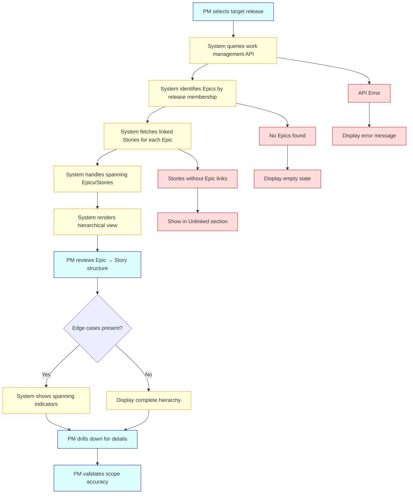
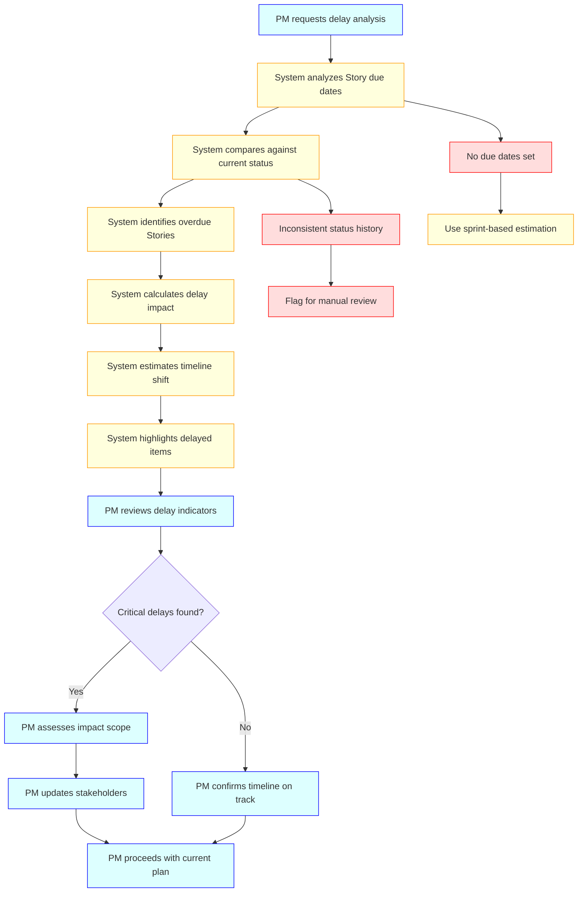
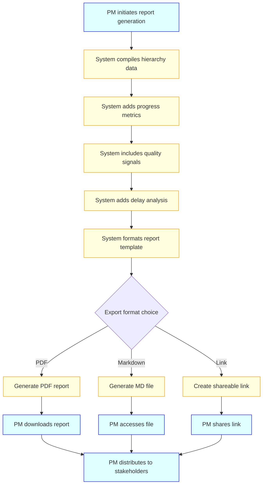

# Business & Functional Requirements

## 1. Purpose
This document defines the detailed business and functional requirements for HALDI (Hierarchical Agile Leadership Dashboard Initiative), a release progress visibility platform that provides unified Epic-Story hierarchical views, quality signals, and timeline impact awareness for project managers and delivery teams.

## 2. Scope
- **In-Scope:**
    - Hierarchical release view showing Epic → Story relationships for selected releases
    - Progress tracking at Epic and Story levels with completion states and counts
    - Quality signals including open bugs by priority linked to Stories
    - Workload signals including open tasks by status linked to Stories  
    - Delay detection and indicative timeline shift impact for remaining work
    - Report generation and export functionality for release progress updates
    - Edge case handling for spanning Epics, multi-linked Stories, and orphaned items
    
- **Out-of-Scope:**
    - Organization-wide productivity benchmarking and cross-team analytics
    - Automated notifications, reminders, or workflow triggers
    - Complex predictive scheduling models beyond simple timeline shift indication
    - Financial planning, resource capacity modeling, or budget tracking
    - Real-time collaboration features or commenting systems

## 3. Stakeholders
- **Primary:** Project Managers, Delivery Managers, Engineering Managers
- **Secondary:** Product Owners, Product Managers, Leadership Stakeholders consuming release updates

## 4. Key Use Cases

### Use Case UC-001: View Release Hierarchy
**Description:** Project Manager selects a release and views all associated Epics and Stories in hierarchical structure.  
**Actors:** Project Manager, Delivery Manager  
**Preconditions:** Release data exists in work management system with proper Epic-Story linkages.  
**Main Flow:**  



**Alternate Flows:**
- Epic spans multiple releases: Show Epic with subset of Stories relevant to selected release
- Story linked to multiple Epics: Display under primary Epic with secondary association indicators
- Orphaned Stories: Display in separate "Unlinked Stories" section with release membership
- No release data: Display empty state with guidance for data setup

### Use Case UC-002: Track Progress and Quality Signals
**Description:** View progress status and quality indicators for Epics and Stories within a release.  
**Actors:** Project Manager, Delivery Manager  
**Preconditions:** Release hierarchy loaded successfully with work items.  
**Main Flow:**

```mermaid
flowchart TD
    A[PM views loaded release hierarchy] --> B[System calculates Epic progress]
    B --> C[System aggregates Story completion counts]
    C --> D[System fetches linked bugs by priority]
    D --> E[System fetches linked tasks by status]
    E --> F[System renders progress indicators]
    F --> G[System displays quality signals]
    G --> H[PM reviews progress vs scope]
    H --> I{Quality issues detected?}
    I -->|Yes| J[PM investigates P1/P2 bugs]
    I -->|No| K[PM confirms progress accuracy]
    J --> L[PM escalates critical issues]
    K --> M[PM proceeds with planning]
    L --> M
    
    %% Alternate flows
    B --> N[Stories in unknown status]
    N --> O[Mark as "Needs Review"]
    D --> P[Bug priority not set]
    P --> Q[Display as "Unclassified"]
    
    classDef user fill:#DFF,stroke:#00F
    classDef system fill:#FFD,stroke:#F90
    classDef warning fill:#FFA,stroke:#FA0
    
    class A,H,J,K,L,M user
    class B,C,D,E,F,G system
    class N,O,P,Q warning
```

**Alternate Flows:**
- Missing status information: Display items as "Needs Review" with indicators
- Bugs without priority classification: Show as "Unclassified" in separate section  
- Tasks without clear status: Group under "Status Unknown" for PM attention
- Performance issues with large datasets: Implement pagination or progressive loading

### Use Case UC-003: Detect Delays and Timeline Impact
**Description:** Identify delayed Stories and assess indicative timeline shift for remaining work.  
**Actors:** Project Manager, Delivery Manager  
**Preconditions:** Stories have due dates or sprint assignments, status history available.  
**Main Flow:**



**Alternate Flows:**
- No due dates configured: Use sprint boundaries for delay calculation
- Inconsistent status transitions: Flag items for manual PM review
- External dependencies causing delays: Surface dependency indicators
- Scope changes affecting timeline: Distinguish between delay and scope adjustment

## 4b. Secondary Use Cases

### Use Case UC-004: Generate Release Report
**Description:** Export or share a comprehensive release progress report.  
**Actors:** Project Manager  
**Preconditions:** Release data loaded and validated by PM.  
**Main Flow:**



**Alternate Flows:**
- Large dataset export: Implement chunked generation with progress indicator
- Template customization: Allow basic formatting preferences
- Export failures: Provide retry mechanism and error details
- Scheduled exports: Support recurring report generation (future enhancement)

## 5. Functional Requirements

1. **FR-001:** System shall connect to work management platform APIs (Jira) to fetch Epics, Stories, Bugs, and Tasks.
2. **FR-002:** System shall identify release membership through fixVersion or release label fields.
3. **FR-003:** System shall display Epic → Story hierarchy for selected release with visual nesting.
4. **FR-004:** System shall handle Epics spanning multiple releases by showing relevant Stories only.
5. **FR-005:** System shall display Stories linked to multiple Epics under primary Epic with secondary indicators.
6. **FR-006:** System shall calculate and display Epic progress based on Story completion counts.
7. **FR-007:** System shall show Story-level progress with status indicators (To Do, In Progress, Done).
8. **FR-008:** System shall display open bugs linked to Stories grouped by priority (P1, P2, P3).
9. **FR-009:** System shall show open tasks linked to Stories with current status.
10. **FR-010:** System shall identify delayed Stories by comparing due dates to current status.
11. **FR-011:** System shall calculate indicative timeline shift for remaining Stories based on delays.
12. **FR-012:** System shall highlight delayed items with visual indicators and impact assessment.
13. **FR-013:** System shall generate exportable reports in PDF, Markdown, and shareable link formats.
14. **FR-014:** System shall provide empty state guidance when no release data is available.
15. **FR-015:** System shall handle API errors gracefully with user-friendly error messages.
16. **FR-016:** System shall display release KPIs: overall completion, epics completed, stories on track, open bugs, open tasks, delayed items.
17. **FR-017:** System shall render summary graphs for Epics, Stories, and Tasks across status categories: Completed, Delayed, In Progress, Not Started.
18. **FR-018:** System shall include a scheduler job that pulls Jira API data into the application database at specified intervals.
19. **FR-019:** System shall provide an API endpoint to manually trigger the scheduler job on demand.

## 6. Acceptance Criteria

**FR-001 / UC-001:**
- AC1: System successfully authenticates with Jira API using provided credentials
- AC2: System retrieves Epic, Story, Bug, and Task data within 10 seconds for typical releases
- AC3: API errors display specific error messages with retry options

**FR-003 / UC-001:**  
- AC1: Epic names display as expandable sections with Story count indicators
- AC2: Stories appear indented under their parent Epics with clear visual hierarchy
- AC3: Hierarchy remains consistent across browser refresh and navigation

**FR-004, FR-005 / UC-001:**
- AC1: Spanning Epics show "(Partial)" indicator with tooltip explaining scope
- AC2: Multi-linked Stories display primary Epic association with "Also in: Epic-X" notation

**FR-006, FR-007 / UC-002:**
- AC1: Epic progress shows "X of Y Stories complete" with percentage and progress bar
- AC2: Story status uses color coding: Red (To Do), Yellow (In Progress), Green (Done)
- AC3: Progress calculations update within 5 seconds of underlying data changes

**FR-008, FR-009 / UC-002:**
- AC1: Bugs display with priority badges (P1: Red, P2: Orange, P3: Yellow) and count
- AC2: Tasks show status with standard workflow states and assignee information
- AC3: Quality signals expand on click to show detailed bug/task listings

**FR-010, FR-011, FR-012 / UC-003:**
- AC1: Delayed Stories show red warning icon with days overdue count
- AC2: Timeline shift displays as "+X days impact" with affected Story count
- AC3: Delay analysis updates daily and shows calculation methodology on hover

**FR-013 / UC-004:**
- AC1: PDF export generates within 30 seconds and includes all hierarchy, progress, and delay data
- AC2: Markdown export creates properly formatted file with tables and section headers
- AC3: Shareable links remain accessible for 30 days with view-only permissions

**FR-016 / UC-002:**
- AC1: KPIs display includes overall completion, epics completed, stories on track, open bugs, open tasks, delayed items.
- AC2: KPI values update within 5 seconds after underlying data changes.
- AC3: KPI tiles/tooltips show calculation definitions for transparency.

**FR-017 / UC-002:**
- AC1: Summary graphs render status breakdowns for Epics, Stories, and Tasks across Completed, Delayed, In Progress, Not Started.
- AC2: Graphs support at least bar and donut views; default to bar.
- AC3: Graphs load within 3 seconds for up to 2,000 items and refresh in place without full page reload.

**FR-018:**
- AC1: Scheduler interval is configurable (e.g., cron expression) with default every 15 minutes.
- AC2: Each run is idempotent: re-fetches only changed issues since last successful run (via `updated` timestamp or changelog).
- AC3: Retries with exponential backoff on transient Jira/API/network errors; maximum 3 retries per batch.
- AC4: Writes are atomic per batch and produce audit logs containing run ID, start/end time, item counts, successes/failures.
- AC5: Respect Jira rate limits and paginate (`maxResults`, `startAt`) without exceeding quotas.

**FR-019:**
- AC1: Protected API endpoint requires authentication and appropriate role (e.g., Admin) to trigger the scheduler.
- AC2: Manual trigger enqueues a job immediately and returns a run ID for tracking.
- AC3: Endpoint supports a "dry-run" mode that reports the would-be changes without persisting.
- AC4: Concurrent run protection: if a job is already running, manual trigger either queues or returns a clear conflict response.

## 7. Non-Functional Requirements
- **Performance:** API responses complete within 10 seconds for releases with up to 50 Epics
- **Security:** API credentials stored securely, shareable links expire after 30 days
- **Reliability:** System maintains 99% uptime during business hours with graceful degradation
- **Usability:** Interface loads and renders hierarchy within 3 seconds on standard browsers
- **Compatibility:** Supports Jira Cloud API v3, extensible for other work management platforms

## 8. Data Models & Entities

On hold pending validation of Jira API responses. This section will be finalized after inspecting actual payloads (fields, relationships, pagination and filtering behavior). For now:
- Placeholder: Entities likely include Release, Epic, Story, Bug, Task with associations via fixVersion/labels and issue links.
- Action: Capture real response samples and update class diagram accordingly.

### Next Steps: Jira API Response Sampling
- Endpoints to sample:
    - `GET /rest/api/3/search` (JQL for releases via `fixVersion` and labels)
    - `GET /rest/api/3/issue/{issueIdOrKey}` (detail for Epic/Story/Bug/Task)
    - `GET /rest/api/3/project/{projectIdOrKey}/versions` (release versions metadata)
    - `GET /rest/api/3/issue/{issueIdOrKey}/changelog` (status history for delay analysis)
    - `GET /rest/api/3/priority` (bug priority taxonomy)
- Fields to capture:
    - Core: `key`, `summary`, `status`, `issuetype`, `fixVersion`, `labels`, `assignee`
    - Links: `epic link` (custom field), `issuelinks` (dependencies, relates to)
    - Dates: `duedate`, `created`, `updated`, sprint fields (via Agile API if used)
    - Metrics: `priority` (for bugs), story status categories (To Do/In Progress/Done)
- Considerations:
    - Pagination: `maxResults`, `startAt`, total count
    - Rate limits and batching strategy for hierarchy fetches
    - Project-specific custom fields mapping (e.g., Epic Link field ID)

## 9. Business Rules & Constraints
- Rule 1: Epic progress calculated as (completed Stories / total Stories) × 100
- Rule 2: Story delay determined when current date > due date and status ≠ "Done"
- Rule 3: Timeline shift = (average delay per Story) × (remaining Stories count)
- Rule 4: P1 bugs must be visible prominently if open > 3 business days
- Rule 5: Release membership determined by fixVersion field, fallback to release labels
- Rule 6: Primary Epic association determined by first Epic link or most recent assignment

## 10. Assumptions & Dependencies
- **Assumptions:** 
    - Teams maintain current Epic-Story linkages in work management system
    - Due dates are set consistently for timeline analysis accuracy
    - Release membership fields (fixVersion/labels) are populated correctly
    - API rate limits allow for real-time data refresh during business hours
- **Dependencies:** 
    - Jira Cloud API availability and authentication
    - Consistent network connectivity for API calls
    - Work management system data quality and completeness

## 11. Glossary
- **Epic:** Large work item that groups related Stories, may span multiple releases
- **Story:** Individual deliverable work item that belongs to one or more Epics  
- **Release:** Time-boxed delivery milestone containing targeted Epics and Stories
- **fixVersion:** Jira field indicating which release(s) an item is targeted for
- **Timeline Shift:** Indicative delay impact on remaining work based on current delays
- **Spanning Item:** Epic or Story associated with multiple releases
- **Primary Association:** Main Epic linkage for Stories with multiple Epic connections

## 12. Open Questions
- Should the system support custom work management platforms beyond Jira in Phase 1?
- How should conflicting due dates be resolved when Stories have multiple Epic associations?
- Should timeline shift calculations include weekends and holidays in delay impact?
- What level of historical data retention is needed for delay pattern analysis?
- Should the system cache data locally or always fetch real-time information?