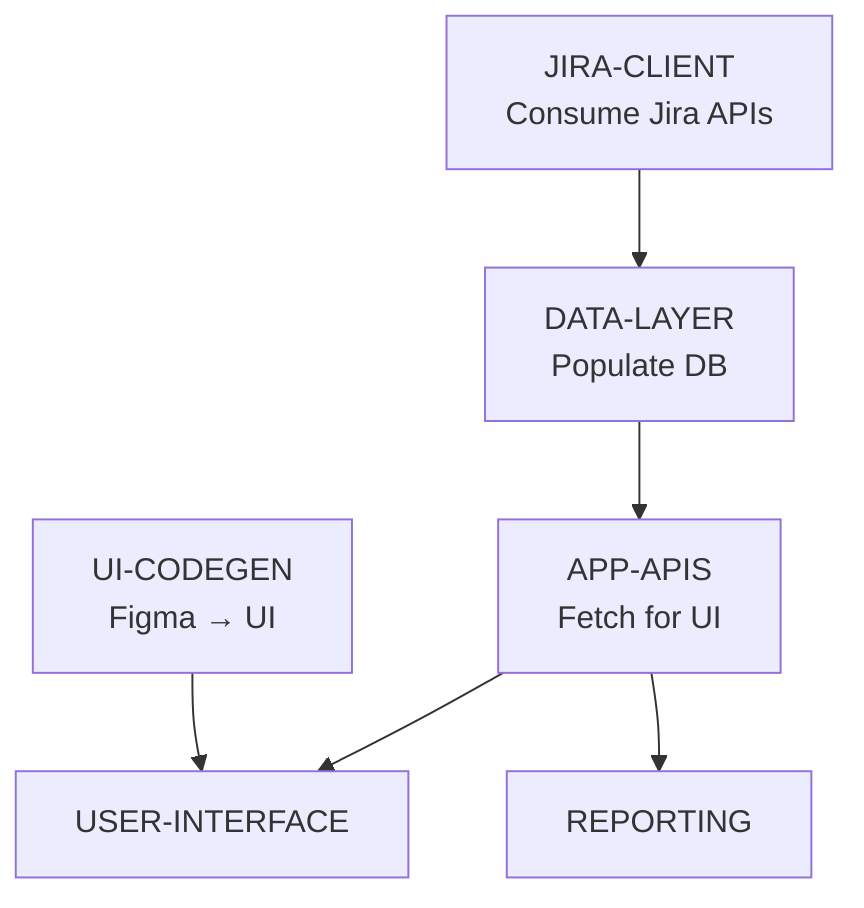

# Implementation Roadmap

## 1. Overview
- **Purpose:** Build sequence for HALDI MVP
- **Approach:** Dependency-driven component sequencing
- **Milestones:** 3 key deliverable milestones
- **Team Capacity:** 2 developers (parallel per milestone)

## 2. Components

### Foundation Components (Build First)
- **UI-CODEGEN:** Generate UI from Figma designs for `apps/ui-hk-gamar` (base screens, components, routing)
- **JIRA-CLIENT:** Secure Jira API consumption (OAuth/API token, rate limits)

### Core Components (Build Second)
- **DATA-LAYER:** Persistence models + ingestion pipeline (populate DB from Jira)
- **APP-APIS:** Backend API (BFF) to read persisted data for UI

### Feature Components (Build Third)
- **USER-INTERFACE:** Bind generated UI to APP-APIS, render real data
- **REPORTING:** Export Markdown/PDF/Link report (depends on APP-APIS + DATA-LAYER)

## 3. Build Sequence

## 4. Build Milestones

### Milestone 1: Foundations Ready
**Components:** UI-CODEGEN, JIRA-CLIENT  
**What You Get:** Base UI scaffold from Figma and secure Jira connectivity  
**Why First:** Establish UI shell and external data access  
**Success Criteria:**
- ✅ Figma-to-code components integrated in `apps/ui-hk-gamar`
- ✅ Jira OAuth/API token configured; secrets stored safely
- ✅ Basic Jira fetches verified (Epics, Stories, Bugs, Tasks)
- ✅ Rate-limit/pagination handling patterns established
**Parallel Work:** Dev A → UI-CODEGEN; Dev B → JIRA-CLIENT

### Milestone 2: Data Pipeline + APIs
**Components:** DATA-LAYER, APP-APIS  
**What You Get:** Database populated from Jira and app APIs to serve UI  
**Why Second:** UI needs persisted data and stable APIs  
**Success Criteria:**
- ✅ Ingestion jobs populate DB entities (Release, Epic, Story, Bug, Task)
- ✅ Data integrity checks; idempotent updates; backoff on rate limits
- ✅ App APIs: `/releases`, `/release/:id/hierarchy`, `/release/:id/signals`
- ✅ Pagination and error surfaces standardized
**Parallel Work:** Dev A → DATA-LAYER; Dev B → APP-APIS

### Milestone 3: UI Data Binding + Reports
**Components:** USER-INTERFACE, REPORTING  
**What You Get:** Data-driven UI and exportable reports  
**Why Last:** Depends on app APIs and persisted data  
**Success Criteria:**
- ✅ UI binds to APP-APIS; release selector, hierarchy, signals rendered
- ✅ Edge cases handled: spanning epics, orphan/multi-linked stories
- ✅ Report export: Markdown + PDF + shareable link
- ✅ Basic template customization; retries on export failures
**Parallel Work:** Dev A → USER-INTERFACE; Dev B → REPORTING

## 5. Parallel Development

### What Can Be Built Together
- **Milestone 1:** UI-CODEGEN + JIRA-CLIENT
- **Milestone 2:** DATA-LAYER + APP-APIS
- **Milestone 3:** USER-INTERFACE + REPORTING

### What Must Be Sequential
- Foundation → Core → Features (milestones do not overlap)

## 6. Dependency Notes
- **UI-CODEGEN:** Figma-driven components/pages scaffold; keep decoupled from data bindings.
- **JIRA-CLIENT:** Secure token/OAuth; pagination, rate-limit backoff; normalized payloads.
- **DATA-LAYER:** Schemas + mappers; ingestion jobs; idempotent upserts; audits.
- **APP-APIS:** Versioned endpoints for UI; consistent error/pagination contracts.
- **USER-INTERFACE:** Bind to APP-APIS; progressive loading; hierarchy-first UX.
- **REPORTING:** Deterministic templates; chunked export; link generation.

## 7. Milestone Deliverables
- **M1 Artifacts:** Auth module, Jira client, entity schemas, release membership functions
- **M2 Artifacts:** REST endpoints, aggregation services, delay heuristics, unit tests on calculators
- **M3 Artifacts:** UI views/components, export templates, PDF/MD generator, link service

## 8. Risk & Mitigation
- **API Rate Limits:** Implement caching/backoff; paginate responses
- **Data Hygiene Variability:** Fallbacks for labels; empty-state guidance
- **Timeline Heuristics Simplicity:** Clearly label as indicative; allow PM overrides (future)

## 9. Success Metrics (MVP)
- ≥95% correct release mapping; ≥90% hierarchical completeness
- ≤5 minutes to generate/share report; ≥80% manual consolidation reduction
- ≥90% delayed Stories flagged; 100% bug/task visibility by category
