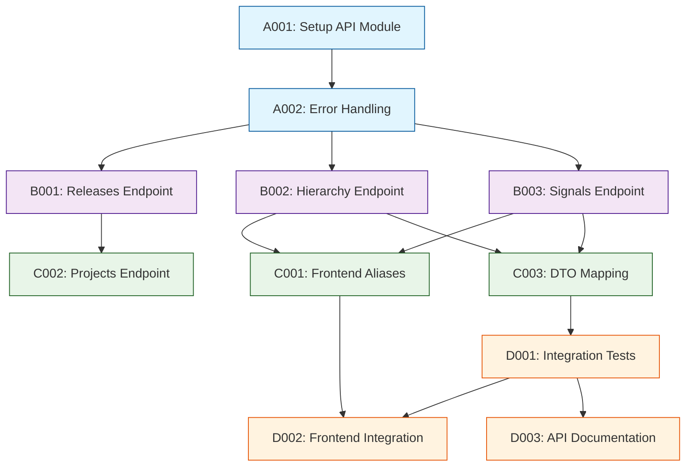

# Tasks - Phase 1

## 1. Task Overview

- **Component:** APP-APIS
- **Phase:** 1
- **Technical Spec:** [phase-1-technical-spec.md](./phase-1-technical-spec.md)
- **Total Estimated Effort:** 24 story points
- **Implementation Order:** 4 task groups in sequence
- **Phase 1 Scope:** REST API endpoints for releases list, hierarchy view, and signals/KPIs with frontend-compatible response contracts, error handling, pagination, and integration with existing frontend

## 2. Task Categories

### Category A: Foundation & Setup
API infrastructure and routing setup

### Category B: Core Endpoints
Primary API endpoints implementation

### Category C: Frontend Integration
Frontend compatibility layer and response mapping

### Category D: Testing & Documentation
API testing and integration documentation

## 3. Detailed Task Breakdown

### 📋 Foundation & Setup

#### TASK-A001: Setup NestJS API module and routing structure

- **Summary:** APP-APIS - Setup API Module & Controllers
- **Issue Type:** Story
- **Epic Link:** APP-APIS Epic
- **Story Points:** 2
- **Priority:** High
- **Labels:** setup, api, infrastructure, app-apis
- **Components:** APP-APIS

- **Description:**
    
    Setup NestJS module structure in existing `apps/bff-hk-gamar` with API controllers, routing, and basic middleware configuration.
    
- **Technical Requirements:**
    
    - Create API module in `apps/bff-hk-gamar/src/api`
    - Setup controllers: `ReleasesController`
    - Configure global API prefix: `/api`
    - Enable CORS for frontend development
    - Add request logging middleware
    - Setup validation pipe for DTOs
    
- **Acceptance Criteria:**
    
    - API module registered in `AppModule`
    - Controllers respond to routes: `/api/releases`, `/api/release/:id/*`
    - CORS enabled for `http://localhost:*` origins
    - Request logging shows method, path, status, duration
    - Validation pipe automatically validates request DTOs
    - Health check endpoint works: `GET /api/health`
    
- **Dependencies:** None

- **Jira Sub-tasks:**
    
    - Create `api` module in bff-hk-gamar
    - Generate controllers: `nx g @nx/nest:controller releases`
    - Configure global prefix in `main.ts`
    - Enable CORS middleware
    - Add request logging interceptor
    - Create health check endpoint

#### TASK-A002: Implement error handling and response standardization

- **Summary:** APP-APIS - Error Handling & Standard Response Format
- **Issue Type:** Story
- **Epic Link:** APP-APIS Epic
- **Story Points:** 3
- **Priority:** High
- **Labels:** error-handling, middleware, app-apis
- **Components:** APP-APIS

- **Description:**
    
    Create standardized error handling with exception filters, response wrappers, and correlation ID tracking for debugging.
    
- **Technical Requirements:**
    
    - Implement global exception filter
    - Standardize error response: `{ code, message, details?, correlationId? }`
    - Map exceptions to HTTP status codes
    - Add correlation ID interceptor for request tracking
    - Create custom exception classes: `NotFoundException`, `ValidationException`, `InternalException`
    - Log errors with correlation IDs
    
- **Acceptance Criteria:**
    
    - All exceptions return standardized error format
    - Correlation ID generated for each request
    - Error codes mapped correctly: NOT_FOUND (404), INVALID_ARGUMENT (400), INTERNAL (500)
    - Exception details excluded in production
    - Errors logged with correlation ID for debugging
    - Unit tests verify exception filter behavior
    
- **Dependencies:** TASK-A001

- **Jira Sub-tasks:**
    
    - Create global exception filter
    - Implement correlation ID interceptor
    - Create custom exception classes
    - Add error response standardization
    - Configure logging with correlation IDs
    - Write unit tests for error handling

### 🔧 Core Endpoints

#### TASK-B001: Implement releases list endpoint

- **Summary:** APP-APIS - GET /api/releases Endpoint
- **Issue Type:** Story
- **Epic Link:** APP-APIS Epic
- **Story Points:** 3
- **Priority:** High
- **Labels:** api, endpoint, releases, app-apis
- **Components:** APP-APIS

- **Description:**
    
    Build releases list endpoint with filtering, pagination, and integration with DATA-LAYER read service.
    
- **Technical Requirements:**
    
    - Implement `GET /api/releases` route
    - Query params: `query`, `status`, `page`, `pageSize`, `projectId`
    - Call DATA-LAYER `listReleases()` service
    - Return paginated response: `{ version: "v1", items: Release[], pageInfo: {} }`
    - Pagination defaults: `page=1`, `pageSize=50`, max=200
    - Support filtering by name search and status
    
- **Acceptance Criteria:**
    
    - Endpoint returns paginated list of releases
    - Query parameter filters releases by name (case-insensitive)
    - Status filter works correctly
    - `pageInfo` includes: `page`, `pageSize`, `total`, `nextPageToken?`
    - Empty array returned when no releases match filters
    - Response includes `version: "v1"` field
    - Integration tests verify filtering and pagination
    
- **Dependencies:** TASK-A002, DATA-LAYER TASK-C001

- **Jira Sub-tasks:**
    
    - Create `ReleasesController.getReleases()` method
    - Add query DTO with validation
    - Integrate DATA-LAYER read service
    - Build response DTO mapper
    - Implement pagination logic
    - Write integration tests

#### TASK-B002: Implement hierarchy endpoint

- **Summary:** APP-APIS - GET /api/release/:id/hierarchy Endpoint
- **Issue Type:** Story
- **Epic Link:** APP-APIS Epic
- **Story Points:** 5
- **Priority:** High
- **Labels:** api, endpoint, hierarchy, app-apis
- **Components:** APP-APIS

- **Description:**
    
    Build hierarchy endpoint returning Epic-Story nested structure with edge-case indicators for visualization.
    
- **Technical Requirements:**
    
    - Implement `GET /api/release/:id/hierarchy` route
    - Path param: `id` (Release ID)
    - Call DATA-LAYER `getReleaseHierarchy()` service
    - Return nested structure: `{ version: "v1", release: {}, epics: [ { id, name, status, stories: [] } ], orphanedStories?: [], notes?: [] }`
    - Include edge-case flags: `partial`, `multiLinked`, `unlinked`
    - Map status categories to frontend format: `completed`, `inProgress`, `delayed`, `notStarted`
    - Calculate epic progress percentage from story completion
    
- **Acceptance Criteria:**
    
    - Endpoint returns release with nested epics and stories
    - Epics include nested stories array
    - Orphaned stories returned in separate array
    - Edge-case notes included when applicable
    - Status mapped to frontend enum: `completed`, `inProgress`, `delayed`, `notStarted`
    - Epic progress calculated correctly (% of completed stories)
    - Story `delayDays` included for delayed items
    - 404 error returned for invalid release ID
    
- **Dependencies:** TASK-A002, DATA-LAYER TASK-C002

- **Jira Sub-tasks:**
    
    - Create `ReleasesController.getHierarchy()` method
    - Add path param validation
    - Integrate DATA-LAYER hierarchy service
    - Build response DTO with nested structure
    - Implement status mapping logic
    - Calculate epic progress percentages
    - Handle 404 for missing releases
    - Write integration tests

#### TASK-B003: Implement signals and KPIs endpoint

- **Summary:** APP-APIS - GET /api/release/:id/signals Endpoint
- **Issue Type:** Story
- **Epic Link:** APP-APIS Epic
- **Story Points:** 5
- **Priority:** High
- **Labels:** api, endpoint, kpi, signals, app-apis
- **Components:** APP-APIS

- **Description:**
    
    Build signals endpoint returning KPI metrics and grouped bugs/tasks for dashboard metrics display.
    
- **Technical Requirements:**
    
    - Implement `GET /api/release/:id/signals` route
    - Call DATA-LAYER `getReleaseSignals()` service
    - Return KPIs: completion %, epics completed, stories on track, delayed items, open bugs, open tasks
    - Return grouped bugs by priority: `{ P0, P1, P2, P3, P4, Unclassified }`
    - Return grouped tasks by status: `{ Open, InProgress, Closed }`
    - Format KPIs for frontend consumption with labels and values
    
- **Acceptance Criteria:**
    
    - Endpoint returns comprehensive KPIs object
    - KPIs include: `overallCompletion`, `epicsCompleted`, `storiesOnTrack`, `delayedItems`, `openBugs`, `openTasks`
    - Bug counts grouped by priority correctly
    - Task counts grouped by status correctly
    - Percentages formatted as strings (e.g., "68%")
    - Counts formatted as strings (e.g., "12/18")
    - 404 error returned for invalid release ID
    
- **Dependencies:** TASK-A002, DATA-LAYER TASK-C003

- **Jira Sub-tasks:**
    
    - Create `ReleasesController.getSignals()` method
    - Integrate DATA-LAYER signals service
    - Build KPI response DTO
    - Format percentages and counts
    - Build bug/task grouping response
    - Handle 404 for missing releases
    - Write integration tests

### 🔗 Frontend Integration

#### TASK-C001: Create frontend-compatible endpoint aliases

- **Summary:** APP-APIS - Frontend Compatibility Layer
- **Issue Type:** Story
- **Epic Link:** APP-APIS Epic
- **Story Points:** 2
- **Priority:** High
- **Labels:** frontend, integration, compatibility, app-apis
- **Components:** APP-APIS

- **Description:**
    
    Add endpoint aliases to match existing frontend expectations from `New Project Setup/src/services/api.ts` without requiring frontend refactoring.
    
- **Technical Requirements:**
    
    - Create route aliases:
        - `/api/releases/:id/metrics` → maps to signals endpoint (KPIs)
        - `/api/releases/:id/epics` → maps to hierarchy endpoint
        - `/api/releases/:id/charts` → stub or derive from signals/hierarchy
    - Maintain consistent response format across aliases
    - Add deprecation warnings in headers for alias routes
    - Document migration path for frontend
    
- **Acceptance Criteria:**
    
    - `/api/releases/:id/metrics` returns KPIs (same as signals)
    - `/api/releases/:id/epics` returns hierarchy (same as hierarchy)
    - `/api/releases/:id/charts` returns stub or basic chart data
    - Response formats match frontend expectations
    - Deprecation header added: `X-Deprecated: Use /api/release/:id/signals instead`
    - Frontend can fetch data without modifications
    
- **Dependencies:** TASK-B002, TASK-B003

- **Jira Sub-tasks:**
    
    - Create alias routes in controller
    - Map alias endpoints to primary endpoints
    - Add deprecation warning headers
    - Implement stub for charts endpoint
    - Test frontend integration
    - Document migration path

#### TASK-C002: Implement projects list endpoint for frontend selector

- **Summary:** APP-APIS - GET /api/projects Endpoint
- **Issue Type:** Story
- **Epic Link:** APP-APIS Epic
- **Story Points:** 2
- **Priority:** Medium
- **Labels:** api, endpoint, projects, app-apis
- **Components:** APP-APIS

- **Description:**
    
    Build projects list endpoint to populate project selector in frontend dashboard header.
    
- **Technical Requirements:**
    
    - Implement `GET /api/projects` route
    - Query database for distinct `projectId` values from releases
    - Return array: `[ { id, name } ]`
    - Name can be derived from project key initially (e.g., "PROJ-123" → "PROJ-123")
    - Support future enhancement: fetch project names from Jira or config
    
- **Acceptance Criteria:**
    
    - Endpoint returns array of projects
    - Each project has `id` and `name` fields
    - Distinct projects extracted from releases table
    - Empty array returned when no releases exist
    - Response format matches frontend interface
    
- **Dependencies:** TASK-B001

- **Jira Sub-tasks:**
    
    - Create `ProjectsController.getProjects()` method
    - Query distinct project IDs from releases
    - Build response DTO
    - Write integration tests

#### TASK-C003: Map frontend data structures to API responses

- **Summary:** APP-APIS - Response DTO Mapping for Frontend Types
- **Issue Type:** Story
- **Epic Link:** APP-APIS Epic
- **Story Points:** 3
- **Priority:** High
- **Labels:** frontend, dto, mapping, app-apis
- **Components:** APP-APIS

- **Description:**
    
    Create comprehensive DTO mapping layer to transform database entities into frontend-compatible response formats matching TypeScript interfaces in `api.ts`.
    
- **Technical Requirements:**
    
    - Map database status to frontend enum: `completed`, `inProgress`, `delayed`, `notStarted`
    - Status mapping logic:
        - `Done` → `completed`
        - `In Progress` → `inProgress`
        - Overdue (delayDays > 0) → `delayed`
        - `To Do` → `notStarted`
    - Calculate progress percentages for epics
    - Format bug/task counts: `openBugs`, `openTasks` per story
    - Ensure response shapes match frontend TypeScript interfaces exactly
    
- **Acceptance Criteria:**
    
    - All API responses match frontend TypeScript interfaces
    - Status enum mapping consistent across all endpoints
    - Epic progress calculated from story completion
    - Story includes: `openBugs`, `openTasks`, `delayDays?`
    - Unit tests verify DTO mapping correctness
    - No type errors when integrating with frontend
    
- **Dependencies:** TASK-B002, TASK-B003

- **Jira Sub-tasks:**
    
    - Create DTO mapper utility functions
    - Implement status enum mapping
    - Calculate epic progress percentages
    - Add bug/task counts to story responses
    - Write unit tests for all mappers
    - Validate against frontend TypeScript types

### ✨ Testing & Documentation

#### TASK-D001: Integration testing with DATA-LAYER

- **Summary:** APP-APIS - Integration Tests with DATA-LAYER
- **Issue Type:** Story
- **Epic Link:** APP-APIS Epic
- **Story Points:** 5
- **Priority:** High
- **Labels:** testing, integration, app-apis
- **Components:** APP-APIS

- **Description:**
    
    Create comprehensive integration test suite covering all API endpoints with real database connections and DATA-LAYER services.
    
- **Technical Requirements:**
    
    - Setup test database with sample data
    - Test all endpoints: releases, hierarchy, signals, projects
    - Verify response contracts and status codes
    - Test error cases: 404, 400, 500
    - Test pagination and filtering
    - Test edge cases: orphaned stories, spanning epics
    - Measure response times (should be < 3s)
    
- **Acceptance Criteria:**
    
    - Integration tests cover all API endpoints
    - Tests use real test database with seeded data
    - Response formats validated against DTOs
    - Error scenarios tested: invalid IDs, missing data
    - Pagination and filtering verified
    - Edge cases validated in responses
    - Performance benchmarks met (p95 < 3s)
    
- **Dependencies:** TASK-C003

- **Jira Sub-tasks:**
    
    - Setup test database with seed data
    - Write integration tests for releases endpoint
    - Write integration tests for hierarchy endpoint
    - Write integration tests for signals endpoint
    - Test error handling scenarios
    - Test pagination and filtering
    - Add performance benchmarks

#### TASK-D002: Frontend integration testing

- **Summary:** APP-APIS - Frontend Integration Verification
- **Issue Type:** Story
- **Epic Link:** APP-APIS Epic
- **Story Points:** 3
- **Priority:** High
- **Labels:** testing, frontend, integration, app-apis
- **Components:** APP-APIS

- **Description:**
    
    Verify end-to-end integration between backend APIs and existing frontend in `New Project Setup` folder.
    
- **Technical Requirements:**
    
    - Update frontend `api.ts` to point to backend endpoints
    - Replace mock API calls with real fetch calls
    - Test all frontend components with real data
    - Verify dashboard renders correctly with backend data
    - Test error handling in UI (empty states, errors)
    - Validate data flow: project selector → release selector → dashboard
    
- **Acceptance Criteria:**
    
    - Frontend successfully fetches data from backend APIs
    - All dashboard components render with real data
    - Project and release selectors work correctly
    - Metrics, hierarchy, and charts display accurate data
    - Error states handled gracefully in UI
    - No CORS errors or connection issues
    
- **Dependencies:** TASK-C001, TASK-D001

- **Jira Sub-tasks:**
    
    - Update frontend API base URL
    - Replace mock functions with real fetch calls
    - Test project/release selection flow
    - Verify metrics display
    - Test hierarchy view rendering
    - Test error handling in UI
    - Fix any integration issues

#### TASK-D003: API documentation and OpenAPI spec

- **Summary:** APP-APIS - API Documentation & OpenAPI Specification
- **Issue Type:** Story
- **Epic Link:** APP-APIS Epic
- **Story Points:** 2
- **Priority:** Low
- **Labels:** documentation, openapi, app-apis
- **Components:** APP-APIS

- **Description:**
    
    Generate comprehensive API documentation with OpenAPI/Swagger specification and interactive API explorer.
    
- **Technical Requirements:**
    
    - Install `@nestjs/swagger` package
    - Add Swagger decorators to all endpoints
    - Document request/response DTOs
    - Document query parameters and path params
    - Add example responses
    - Enable Swagger UI at `/api/docs`
    
- **Acceptance Criteria:**
    
    - Swagger UI accessible at `/api/docs`
    - All endpoints documented with descriptions
    - Request/response schemas defined
    - Query params and path params documented
    - Example responses provided
    - API can be tested via Swagger UI
    
- **Dependencies:** TASK-D001

- **Jira Sub-tasks:**
    
    - Install Swagger dependencies
    - Add Swagger decorators to controllers
    - Document DTOs with ApiProperty decorators
    - Add example responses
    - Configure Swagger UI
    - Write API usage guide

## 4. Task Dependencies & Sequencing

## 5. Parallel Development Opportunities

### What Can Be Built Simultaneously:

- **After A002:** B001, B002, and B003 can start in parallel (different endpoints)
- **After B002 and B003:** C001 and C003 can start in parallel
- **After D001:** D002 and D003 can start in parallel

### Critical Path:

A001 → A002 → B002 → C003 → D001 → D002

## 6. Risk Mitigation Tasks

### Technical Risks:

- **Risk API-R1 (Frontend Breaking Changes):** Mitigated in TASK-C001 with endpoint aliases
- **Risk API-R2 (Performance):** Basic pagination in TASK-B001; optimize in DATA-LAYER
- **Risk API-R3 (Contract Drift):** Version field and DTO mapping in TASK-C003

## 7. Definition of Done

### Task Completion Criteria:

- ✅ All acceptance criteria met
- ✅ Unit tests written and passing (>80% coverage)
- ✅ Code review completed
- ✅ Integration tests passing
- ✅ API documentation updated

### Component Completion Criteria:

- ✅ All tasks completed per definition of done
- ✅ Technical specification requirements met
- ✅ Integration with frontend verified and working
- ✅ Performance targets met (p95 < 3s)
- ✅ Ready for MVP deployment

## 8. Estimation Summary

| Category | Task Count | Total Effort | Duration (days) |
|----------|-----------|--------------|-----------------|
| Foundation & Setup | 2 | 5 points | 2-3 days |
| Core Endpoints | 3 | 13 points | 6-7 days |
| Frontend Integration | 3 | 7 points | 3-4 days |
| Testing & Documentation | 3 | 10 points | 4-6 days |
| **TOTAL** | **11** | **35 points** | **15-20 days** |

## 9. Traceability Matrix

| Task ID | Technical Spec Section | Functional Requirements | Business Value |
|---------|------------------------|-------------------------|----------------|
| A001 | Section 5.1 | Setup/Infrastructure | API foundation |
| A002 | Section 3.3 | FR-APP-APIS-004 | Error handling |
| B001 | Section 3.1 | FR-APP-APIS-001 | Release listing |
| B002 | Section 3.1 | FR-APP-APIS-002 | Hierarchy visualization |
| B003 | Section 3.1 | FR-APP-APIS-003 | KPI metrics |
| C001 | Section 3.1 | Frontend Compatibility | Seamless integration |
| C002 | Section 3.1 | UI Project Selector | User experience |
| C003 | Section 3.2 | Response Contracts | Type safety |
| D001 | Section 10.2 | Testing Strategy | Quality assurance |
| D002 | Section 6.1 | Frontend Integration | MVP completion |
| D003 | Section 11.1 | Documentation | Developer experience |

## 10. Implementation Notes

### Development Best Practices:

- Use NestJS decorators for clean controller code
- Implement DTOs with class-validator for automatic validation
- Use dependency injection for DATA-LAYER services
- Keep controllers thin - delegate logic to services
- Use interceptors for cross-cutting concerns

### Quality Gates:

- Unit test coverage minimum 80%
- Integration tests pass with real database
- Frontend integration verified with no errors
- API response times < 3s for p95
- OpenAPI spec generated and accurate

### Communication Plan:

- Daily standup updates on endpoint progress
- Demo working endpoints after each core task
- Frontend integration session with UI developer after TASK-C001
- Document any API contract changes immediately
- Share OpenAPI spec with team after TASK-D003

### Frontend Integration Notes:

- Backend runs on: `http://localhost:3000` (default NestJS port)
- Frontend proxy configuration may be needed in `vite.config.ts`
- Update API_BASE_URL in `api.ts` to `/api` (proxy) or `http://localhost:3000/api`
- Test CORS configuration during development
- Use browser dev tools to verify API responses match frontend expectations
