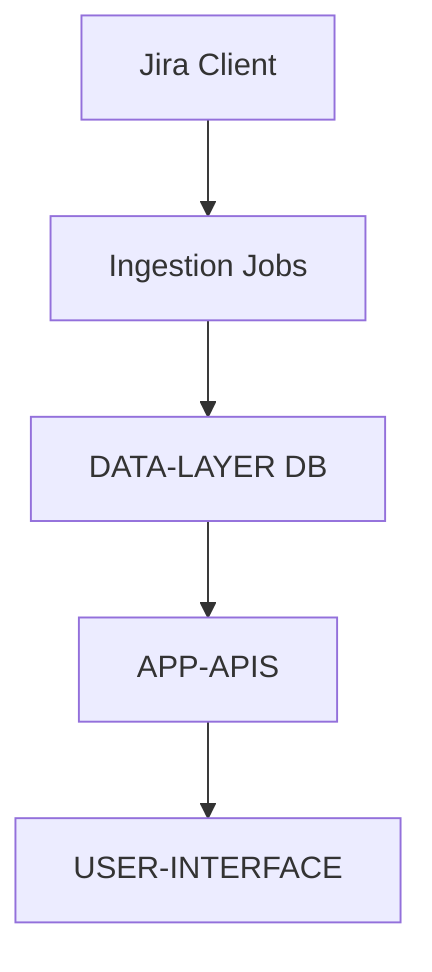

# TRD - Phase 1

## 1. Component Overview
- **Purpose:** Provide read-only backend endpoints for releases, hierarchical Epic → Story views, and signals required by the MVP UI.
- **Scope:** Implement minimal routing and fixed JSON contracts for three endpoints; include pagination and standardized error responses; defer caching and authentication.
- **Phase 1 Scope:**
  - `GET /api/releases`
  - `GET /api/release/:id/hierarchy`
  - `GET /api/release/:id/signals`
  - Pagination defaults; standardized error envelope; contract stability
- **Dependencies:** DATA-LAYER (persisted entities from Jira), JIRA-CLIENT (for ingestion jobs feeding DATA-LAYER)
- **Dependents:** USER-INTERFACE (UI consumes these endpoints), REPORTING (later)

## 2. Functional Requirements
- **FR-APP-APIS-001:** `/releases` returns paginated releases with `id`, `name`, `status`, counts
- **FR-APP-APIS-002:** `/release/:id/hierarchy` returns Epics with nested Stories and edge-case flags
- **FR-APP-APIS-003:** `/release/:id/signals` returns KPIs plus grouped Bugs/Tasks
- **FR-APP-APIS-004:** Standard error response with `code`, `message`, `details`
- **FR-APP-APIS-005:** Pagination defaults: `pageSize`=50, `max`=200

## 3. Component Interface

### 3.1 Public API
- `GET /api/releases?query=&status=&page=&pageSize=`
- `GET /api/release/:id/hierarchy`
- `GET /api/release/:id/signals`

#### Endpoint Mapping (Frontend Compatibility)
- UI mock expectations (from `New Project Setup/src/services/api.ts`) and server routes:
  - `/api/releases/:id/metrics` → maps to `/api/release/:id/signals` (return KPIs under `kpis`)
  - `/api/releases/:id/epics` → maps to `/api/release/:id/hierarchy` (return `epics` array)
  - `/api/releases/:id/charts` → optional; derive from signals/hierarchy or stub for Phase 1
  - Provide aliases for above paths to minimize frontend refactors.

### 3.2 Input/Output Contracts
- **Inputs:**
  - Query params: `query`, `status`, `page`, `pageSize`
  - Path param: `id` (Release ID)
- **Outputs:**
  - `/releases`: `{ version: "v1", items: Release[], pageInfo: { page, pageSize, total, nextPageToken? } }`
  - `/release/:id/hierarchy`: `{ version: "v1", release: ReleaseSummary, epics: EpicWithStories[], notes?: string[] }`
  - `/release/:id/signals`: `{ version: "v1", kpis: KPIs, bugs: BugsByPriority, tasks: TasksByStatus }`
- **Data Formats:** JSON; types documented in UI stubs and PRD

### 3.3 Error Handling
- **Error Types:** `NOT_FOUND`, `INVALID_ARGUMENT`, `INTERNAL`, `DEPENDENCY_UNAVAILABLE`
- **Error Responses:** `{ code: string, message: string, details?: any }` with HTTP status codes; include `X-Correlation-Id` header
- **Recovery Strategies:** Return empty datasets with guidance where appropriate; log correlation ID

## 4. Data Model

### 4.1 Data Storage
- **Storage Type:** Application reads from DATA-LAYER (DB) entities populated via ingestion
- **Data Schema:** Entities: Release, Epic, Story, Bug, Task (normalized)

```sql
-- Illustrative schema (Phase 1 reference)
CREATE TABLE releases (
  id UUID PRIMARY KEY,
  name VARCHAR(255) NOT NULL,
  status VARCHAR(50) NOT NULL,
  project_id UUID NOT NULL
);

CREATE TABLE epics (
  id UUID PRIMARY KEY,
  name VARCHAR(255) NOT NULL,
  status VARCHAR(50) NOT NULL,
  release_id UUID REFERENCES releases(id)
);

CREATE TABLE stories (
  id UUID PRIMARY KEY,
  epic_id UUID REFERENCES epics(id),
  name VARCHAR(255) NOT NULL,
  status VARCHAR(50) NOT NULL,
  assignee VARCHAR(255),
  due_date DATE,
  delay_days INTEGER
);

CREATE TABLE bugs (
  id UUID PRIMARY KEY,
  story_id UUID REFERENCES stories(id),
  priority VARCHAR(10) NOT NULL,
  status VARCHAR(50) NOT NULL
);

CREATE TABLE tasks (
  id UUID PRIMARY KEY,
  story_id UUID REFERENCES stories(id),
  status VARCHAR(50) NOT NULL
);
```

### 4.2 Data Flow


### 4.3 Data Validation
- **Input Validation:** Validate `pageSize` bounds; ensure `id` format; sanitize `query`
- **Business Rules:** Return consistent shapes; include edge-case flags
- **Data Integrity:** Read-only; rely on DATA-LAYER normalization

## 5. Technology Stack

### 5.1 Core Technologies
- **Programming Language:** TypeScript
- **Framework:** NestJS (current backend `apps/bff-hk-gamar`)
- **Database:** As provided by DATA-LAYER (TBD exact tech)
- **Additional Libraries:** NestJS common/core; optional class-validator for params

### 5.2 Technology Rationale
- **Why These Choices:** Aligns with existing NestJS app; fast to implement read APIs
- **Alternatives Considered:** Express/Fastify bare; higher effort for contracts/logging
- **Trade-offs:** Deferring auth/caching reduces complexity but leaves NFRs for later

## 6. Integration Design

### 6.1 Dependency Integration
- **DATA-LAYER:** Service adapters read normalized entities; pagination and filters applied server-side
- **Communication Method:** Direct DB/service calls within app context
- **Data Exchange:** JSON responses, stable shapes

### 6.2 Service Integration
- **External APIs:** None directly (Phase 1 read-only)
- **Authentication:** Deferred; internal only for MVP
- **Rate Limiting:** Not required in Phase 1
- **Fallback Strategies:** Empty datasets and guidance flags

## 7. Performance Considerations

### 7.1 Performance Requirements
- **Response Time:** p95 ≤ 3s for typical releases (≤ 50 epics)
- **Throughput:** Typical MVP loads; no specific RPS targets
- **Scalability:** Basic pagination only

### 7.2 Performance Strategies
- **Caching:** Deferred
- **Database Optimization:** Basic indexes on foreign keys and status fields; avoid N+1 via joins and selective projections
- **Resource Management:** Avoid N+1 via simple joins/aggregations

## 8. Security Design

### 8.1 Security Requirements
- **Authentication:** Deferred
- **Authorization:** Deferred
- **Data Protection:** No sensitive fields returned

### 8.2 Security Implementation
- **Encryption:** TLS via platform
- **Input Sanitization:** Validate/sanitize query params
- **Audit Logging:** Basic request logs; correlation ID optional

## 9. Monitoring & Observability

### 9.1 Logging
- **Log Levels:** Info, Error for API calls
- **Log Format:** Include path, status, timing
- **Sensitive Data:** Do not log tokens or PII

### 9.2 Metrics
- **Performance Metrics:** Request latency (optional)
- **Business Metrics:** Endpoint hit counts (optional)
- **Alerting:** None in Phase 1

## 10. Testing Strategy

### 10.1 Unit Testing
- **Test Coverage:** Handlers/services for each endpoint
- **Key Test Cases:** Empty datasets, NOT_FOUND, pagination bounds
- **Mock Dependencies:** Mock DATA-LAYER adapters

### 10.2 Integration Testing
- **Integration Points:** DB read paths; response contract validation
- **Test Data:** Seed minimal Release/Epic/Story/Bug/Task datasets
- **Environment Requirements:** Local NestJS app with test DB

## 11. Deployment Considerations

### 11.1 Environment Requirements
- **Infrastructure:** Node/NestJS runtime; DB connectivity
- **Configuration:** `PORT`, DB connection settings
- **Secrets Management:** None for Phase 1 read-only

### 11.2 Deployment Strategy
- **Build Process:** Nx/Nest build, container optional
- **Deployment Steps:** Configure env, start server
- **Rollback Plan:** Redeploy previous build

## 12. Risk Mitigation
- **Risk R1 (API Rate/Data Hygiene):** Mitigated by relying on ingest-normalized DATA-LAYER
- **Risk R2 (Large Payloads):** Pagination limits and simple filters
- **Risk R3 (Contract Drift):** Documented stable shapes; version fields reserved

## 13. Future Considerations
- **Extensibility:** Add auth, caching, correlation IDs, OpenAPI spec
- **Migration Path:** Introduce v1 versioning and progressive hierarchy streaming
- **Deprecation Strategy:** Versioned endpoints, migration guides
