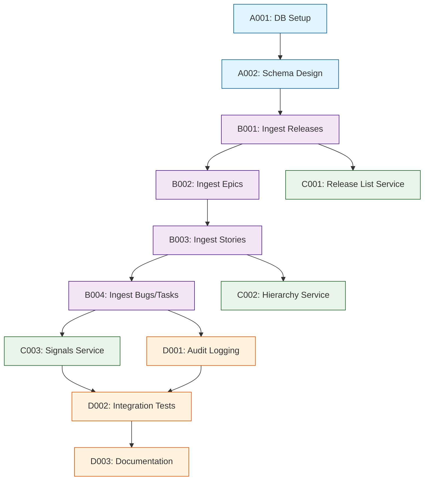

# Tasks - Phase 1

## 1. Task Overview

- **Component:** DATA-LAYER
- **Phase:** 1
- **Technical Spec:** [phase-1-technical-spec.md](./phase-1-technical-spec.md)
- **Total Estimated Effort:** 28 story points
- **Implementation Order:** 4 task groups in sequence
- **Phase 1 Scope:** Database schema setup, ingestion pipeline for Jira entities, normalization and validation, read services for APP-APIS, and basic audit logging

## 2. Task Categories

### Category A: Foundation & Setup
Database configuration and schema design

### Category B: Core Implementation
Ingestion pipeline and entity mappers

### Category C: Read Services & Aggregation
Query services for APP-APIS

### Category D: Testing & Observability
Testing suite and monitoring

## 3. Detailed Task Breakdown

### 📋 Foundation & Setup

#### TASK-A001: Setup database infrastructure and ORM configuration

- **Summary:** DATA-LAYER - Database Setup & ORM Configuration
- **Issue Type:** Story
- **Epic Link:** DATA-LAYER Epic
- **Story Points:** 3
- **Priority:** High
- **Labels:** setup, database, infrastructure, data-layer
- **Components:** DATA-LAYER

- **Description:**
    
    Setup PostgreSQL database connection, configure Prisma ORM, and establish database migration infrastructure.
    
- **Technical Requirements:**
    
    - Install PostgreSQL database (local/Docker for dev)
    - Setup Prisma ORM with TypeScript
    - Configure database connection via environment variables
    - Create `libs/data-layer` Nx library
    - Setup migration infrastructure
    
- **Acceptance Criteria:**
    
    - PostgreSQL database running and accessible
    - Prisma installed and configured: `prisma`, `@prisma/client`
    - Database connection established via `DATABASE_URL` env variable
    - Nx library created for data layer: `libs/data-layer`
    - Migration commands work: `prisma migrate dev`, `prisma generate`
    
- **Dependencies:** None

- **Jira Sub-tasks:**
    
    - Setup PostgreSQL (Docker compose or local install)
    - Generate Nx library: `nx g @nx/node:library data-layer`
    - Install Prisma: `npm install prisma @prisma/client`
    - Initialize Prisma: `npx prisma init`
    - Configure database URL in `.env`
    - Test database connection

#### TASK-A002: Design and implement database schema

- **Summary:** DATA-LAYER - Database Schema Design & Migration
- **Issue Type:** Story
- **Epic Link:** DATA-LAYER Epic
- **Story Points:** 5
- **Priority:** High
- **Labels:** schema, database, data-model, data-layer
- **Components:** DATA-LAYER

- **Description:**
    
    Design relational schema for Release, Epic, Story, Bug, Task entities with proper foreign keys, indexes, and constraints per technical specification.
    
- **Technical Requirements:**
    
    - Define Prisma schema for: `Release`, `Epic`, `Story`, `Bug`, `Task`
    - Add foreign key relationships: Epic→Release, Story→Epic, Bug/Task→Story
    - Create indexes on: `releaseId`, `epicId`, `storyId`, `statusCategory`
    - Add `updatedAt` timestamps for all entities
    - Support edge case flags: `partial`, `multiLinked`, `unlinked`, `needsReview`
    - Include `delayDays` calculated field on Story
    
- **Acceptance Criteria:**
    
    - Prisma schema file defines all 5 entities with correct field types
    - Foreign keys enforce referential integrity
    - Indexes created for query optimization
    - Edge-case boolean flags included: `partial`, `multiLinked`, `unlinked`
    - `updatedAt` timestamp auto-updates on modification
    - Migration successfully applied: `prisma migrate dev`
    - Prisma Client generated with TypeScript types
    
- **Dependencies:** TASK-A001

- **Jira Sub-tasks:**
    
    - Design schema in `prisma/schema.prisma`
    - Define Release model with fields
    - Define Epic model with Release FK
    - Define Story model with Epic FK and delay fields
    - Define Bug model with Story FK and priority
    - Define Task model with Story FK
    - Add indexes for foreign keys and status fields
    - Run migration: `prisma migrate dev --name init`
    - Generate Prisma Client

### 🔧 Core Implementation

#### TASK-B001: Implement Release ingestion service

- **Summary:** DATA-LAYER - Release Ingestion from JIRA-CLIENT
- **Issue Type:** Story
- **Epic Link:** DATA-LAYER Epic
- **Story Points:** 3
- **Priority:** High
- **Labels:** ingestion, releases, data-layer
- **Components:** DATA-LAYER

- **Description:**
    
    Build ingestion service to consume Release DTOs from JIRA-CLIENT and perform idempotent upserts into database with audit logging.
    
- **Technical Requirements:**
    
    - Create `IngestionService` in data-layer module
    - Implement `ingestReleases(projectId: string)` method
    - Call JIRA-CLIENT `getVersions()` to fetch releases
    - Perform idempotent upsert: update if exists, insert if new
    - Use `id` (Jira version ID) as primary key
    - Log ingestion run: start time, count, errors
    
- **Acceptance Criteria:**
    
    - `ingestReleases()` fetches releases via JIRA-CLIENT
    - Upsert logic correctly updates existing releases
    - New releases inserted without duplicates
    - `updatedAt` timestamp updated on each run
    - Audit log entry created with count and duration
    - Idempotent: running multiple times doesn't create duplicates
    
- **Dependencies:** TASK-A002, JIRA-CLIENT TASK-B001

- **Jira Sub-tasks:**
    
    - Create `IngestionService` class
    - Inject JIRA-CLIENT dependency
    - Implement `ingestReleases()` method
    - Build upsert logic with Prisma
    - Add ingestion audit logging
    - Write unit tests with mocked JIRA-CLIENT

#### TASK-B002: Implement Epic ingestion with release association

- **Summary:** DATA-LAYER - Epic Ingestion with Release Linking
- **Issue Type:** Story
- **Epic Link:** DATA-LAYER Epic
- **Story Points:** 3
- **Priority:** High
- **Labels:** ingestion, epics, data-layer
- **Components:** DATA-LAYER

- **Description:**
    
    Ingest Epic DTOs from JIRA-CLIENT, associate with releases, handle spanning epics (partial flag), and perform idempotent upserts.
    
- **Technical Requirements:**
    
    - Implement `ingestEpics(releaseId: string)` method
    - Fetch Epics via JIRA-CLIENT `searchIssues()` for target release
    - Map Epic DTO to database entity
    - Set `releaseId` foreign key
    - Detect spanning epics: mark `partial = true` if Epic has multiple fixVersions
    - Upsert Epics by `id` (Jira issue key)
    
- **Acceptance Criteria:**
    
    - `ingestEpics()` fetches epics for specific release
    - Epic records correctly linked to Release via `releaseId`
    - `partial` flag set when Epic spans multiple releases
    - Idempotent upserts preserve existing data
    - Audit log includes epic count and errors
    - Unit tests verify spanning epic detection
    
- **Dependencies:** TASK-B001, JIRA-CLIENT TASK-B002

- **Jira Sub-tasks:**
    
    - Implement `ingestEpics()` method
    - Build spanning epic detection logic
    - Perform upsert with release association
    - Add audit logging
    - Write unit tests with edge cases

#### TASK-B003: Implement Story ingestion with epic linking

- **Summary:** DATA-LAYER - Story Ingestion with Epic Association
- **Issue Type:** Story
- **Epic Link:** DATA-LAYER Epic
- **Story Points:** 5
- **Priority:** High
- **Labels:** ingestion, stories, data-layer
- **Components:** DATA-LAYER

- **Description:**
    
    Ingest Story DTOs from JIRA-CLIENT, link to Epics, handle multi-linked and orphaned stories, calculate delay days, and perform idempotent upserts.
    
- **Technical Requirements:**
    
    - Implement `ingestStories(releaseId: string)` method
    - Fetch Stories via JIRA-CLIENT `searchIssues()` for target release
    - Link Stories to Epics via `epicId` foreign key
    - Mark `unlinked = true` for orphaned Stories (no Epic link)
    - Mark `multiLinked = true` for Stories linked to multiple Epics
    - Calculate `delayDays`: if `dueDate < now` and `statusCategory != 'Done'`, compute days overdue
    - Upsert Stories by `id` (Jira issue key)
    
- **Acceptance Criteria:**
    
    - `ingestStories()` fetches stories for specific release
    - Stories correctly linked to Epics via `epicId`
    - Orphaned stories marked with `unlinked = true`
    - Multi-linked stories marked with `multiLinked = true`
    - `delayDays` accurately calculated for overdue incomplete stories
    - Idempotent upserts handle status and delay changes
    - Audit log includes story count and edge-case counts
    
- **Dependencies:** TASK-B002, JIRA-CLIENT TASK-B002

- **Jira Sub-tasks:**
    
    - Implement `ingestStories()` method
    - Build Epic linking logic with edge-case detection
    - Implement delay calculation function
    - Perform upsert with computed fields
    - Add audit logging with edge-case metrics
    - Write unit tests for orphaned/multi-linked stories

#### TASK-B004: Implement Bug and Task ingestion with story linking

- **Summary:** DATA-LAYER - Bug & Task Ingestion with Story Association
- **Issue Type:** Story
- **Epic Link:** DATA-LAYER Epic
- **Story Points:** 3
- **Priority:** Medium
- **Labels:** ingestion, bugs, tasks, data-layer
- **Components:** DATA-LAYER

- **Description:**
    
    Ingest Bug and Task DTOs from JIRA-CLIENT, link to Stories, normalize priority and status, and perform idempotent upserts.
    
- **Technical Requirements:**
    
    - Implement `ingestBugsAndTasks(releaseId: string)` method
    - Fetch Bugs and Tasks via JIRA-CLIENT for stories in target release
    - Link via `storyId` foreign key
    - Normalize Bug priority: P0, P1, P2, P3, P4, Unclassified
    - Normalize status to `statusCategory`: Open, In Progress, Closed
    - Upsert by `id` (Jira issue key)
    
- **Acceptance Criteria:**
    
    - `ingestBugsAndTasks()` fetches bugs and tasks for release stories
    - Bugs and tasks correctly linked to Stories via `storyId`
    - Priority normalized to P0-P4 and Unclassified
    - Status normalized to standard categories
    - Idempotent upserts handle priority/status changes
    - Audit log includes bug and task counts by priority/status
    
- **Dependencies:** TASK-B003, JIRA-CLIENT TASK-B003

- **Jira Sub-tasks:**
    
    - Implement `ingestBugsAndTasks()` method
    - Build priority normalization mapper
    - Build status normalization mapper
    - Perform upsert with normalized fields
    - Add audit logging
    - Write unit tests for normalization

### 🔗 Read Services & Aggregation

#### TASK-C001: Implement release list read service

- **Summary:** DATA-LAYER - Release List Query Service for APP-APIS
- **Issue Type:** Story
- **Epic Link:** DATA-LAYER Epic
- **Story Points:** 2
- **Priority:** High
- **Labels:** read-service, api, data-layer
- **Components:** DATA-LAYER

- **Description:**
    
    Build read service to fetch paginated list of releases with basic filtering for APP-APIS `/api/releases` endpoint.
    
- **Technical Requirements:**
    
    - Implement `listReleases(filters, pagination)` method
    - Support filters: `query` (name search), `status`, `projectId`
    - Support pagination: `page`, `pageSize` (default 50, max 200)
    - Return: `{ items: Release[], pageInfo: { page, pageSize, total } }`
    - Calculate total count for pagination metadata
    
- **Acceptance Criteria:**
    
    - `listReleases()` returns paginated array of releases
    - Query filter searches release names (case-insensitive)
    - Status filter works correctly
    - Pagination returns correct page of results
    - `pageInfo` includes accurate `total` count
    - Unit tests verify filtering and pagination
    
- **Dependencies:** TASK-B001

- **Jira Sub-tasks:**
    
    - Create `ReadService` class
    - Implement `listReleases()` with Prisma query
    - Add filtering logic for query and status
    - Implement pagination with skip/take
    - Calculate total count
    - Write unit tests with sample data

#### TASK-C002: Implement hierarchy read service

- **Summary:** DATA-LAYER - Epic-Story Hierarchy Query Service
- **Issue Type:** Story
- **Epic Link:** DATA-LAYER Epic
- **Story Points:** 5
- **Priority:** High
- **Labels:** read-service, hierarchy, api, data-layer
- **Components:** DATA-LAYER

- **Description:**
    
    Build read service to fetch Epic-Story hierarchy for a release with nested relationships and edge-case flags for APP-APIS `/api/release/:id/hierarchy` endpoint.
    
- **Technical Requirements:**
    
    - Implement `getReleaseHierarchy(releaseId: string)` method
    - Fetch Epics for release with nested Stories via Prisma `include`
    - Include edge-case flags: `partial`, `multiLinked`, `unlinked`
    - Return structure: `{ release: Release, epics: Epic[], notes?: string[] }`
    - Generate notes for edge cases: "Some epics span multiple releases", "X orphaned stories"
    
- **Acceptance Criteria:**
    
    - `getReleaseHierarchy()` returns release with nested epics and stories
    - Prisma query uses single query with `include` (no N+1)
    - Edge-case flags correctly populated
    - Notes array includes helpful messages for edge cases
    - Orphaned stories included in separate `orphanedStories` array
    - Unit tests verify nested structure and edge cases
    
- **Dependencies:** TASK-B003

- **Jira Sub-tasks:**
    
    - Implement `getReleaseHierarchy()` method
    - Build nested Prisma query with includes
    - Add orphaned stories handling
    - Generate notes for edge cases
    - Optimize query to avoid N+1 problem
    - Write unit tests with complex hierarchies

#### TASK-C003: Implement signals aggregation service

- **Summary:** DATA-LAYER - KPIs and Signals Aggregation Service
- **Issue Type:** Story
- **Epic Link:** DATA-LAYER Epic
- **Story Points:** 5
- **Priority:** High
- **Labels:** read-service, aggregation, kpi, data-layer
- **Components:** DATA-LAYER

- **Description:**
    
    Build aggregation service to calculate KPIs and group bugs/tasks by priority/status for APP-APIS `/api/release/:id/signals` endpoint.
    
- **Technical Requirements:**
    
    - Implement `getReleaseSignals(releaseId: string)` method
    - Calculate KPIs:
        - Overall completion % (done stories / total stories)
        - Epics completed count (epics with statusCategory = 'Done')
        - Stories on track (stories not delayed)
        - Delayed items count (stories with delayDays > 0)
        - Open bugs count
        - Open tasks count
    - Group bugs by priority: `{ P0: count, P1: count, ..., Unclassified: count }`
    - Group tasks by status: `{ Open: count, InProgress: count, Closed: count }`
    
- **Acceptance Criteria:**
    
    - `getReleaseSignals()` returns KPIs with accurate calculations
    - Bug counts grouped by priority (P0-P4, Unclassified)
    - Task counts grouped by status category
    - KPI percentages calculated correctly
    - Efficient aggregation using Prisma aggregation functions
    - Unit tests verify all KPI calculations
    
- **Dependencies:** TASK-B004

- **Jira Sub-tasks:**
    
    - Implement `getReleaseSignals()` method
    - Build KPI calculation functions
    - Implement bug priority grouping query
    - Implement task status grouping query
    - Calculate completion percentages
    - Write unit tests for aggregations

### ✨ Testing & Observability

#### TASK-D001: Implement audit logging and ingestion tracking

- **Summary:** DATA-LAYER - Audit Logging & Ingestion Run Tracking
- **Issue Type:** Story
- **Epic Link:** DATA-LAYER Epic
- **Story Points:** 3
- **Priority:** Medium
- **Labels:** logging, audit, monitoring, data-layer
- **Components:** DATA-LAYER

- **Description:**
    
    Create audit logging system to track ingestion runs with metrics, errors, and performance data.
    
- **Technical Requirements:**
    
    - Create `IngestionRun` entity to track runs
    - Log: `runId`, `startTime`, `endTime`, `status`, `entityCounts`, `errorSummary`
    - Add structured logging with correlation IDs
    - Track entity counts: releases, epics, stories, bugs, tasks ingested
    - Track edge-case counts: orphaned, multi-linked, delayed items
    - Calculate ingestion duration
    
- **Acceptance Criteria:**
    
    - `IngestionRun` records created for each ingestion
    - Run ID used as correlation ID in all logs
    - Entity counts accurately tracked and logged
    - Error summary includes failure details
    - Ingestion duration calculated and logged
    - Structured logs compatible with log aggregation tools
    
- **Dependencies:** TASK-B004

- **Jira Sub-tasks:**
    
    - Create `IngestionRun` Prisma model
    - Add migration for audit table
    - Implement audit logging in ingestion service
    - Add correlation ID tracking
    - Track entity and edge-case counts
    - Write unit tests for audit logging

#### TASK-D002: Integration and end-to-end testing

- **Summary:** DATA-LAYER - Integration & E2E Tests
- **Issue Type:** Story
- **Epic Link:** DATA-LAYER Epic
- **Story Points:** 5
- **Priority:** High
- **Labels:** testing, integration, e2e, data-layer
- **Components:** DATA-LAYER

- **Description:**
    
    Create comprehensive integration test suite covering full ingestion pipeline and read services with test database.
    
- **Technical Requirements:**
    
    - Setup test PostgreSQL database
    - Mock JIRA-CLIENT responses with sample DTOs
    - Test full ingestion flow: releases → epics → stories → bugs/tasks
    - Verify idempotency: run ingestion twice, check no duplicates
    - Test read services with seeded data
    - Test edge cases: orphaned stories, spanning epics, multi-linked stories
    
- **Acceptance Criteria:**
    
    - Integration tests run against test database
    - Full ingestion pipeline tested end-to-end
    - Idempotency verified: duplicate runs safe
    - Read services return correct data structures
    - Edge cases validated: orphaned, spanning, multi-linked items
    - Tests pass in CI/CD with Docker Postgres
    
- **Dependencies:** TASK-C003, TASK-D001

- **Jira Sub-tasks:**
    
    - Setup test database with Docker
    - Create mock JIRA-CLIENT data fixtures
    - Write ingestion pipeline integration tests
    - Test idempotency with duplicate runs
    - Write read service integration tests
    - Test edge-case handling
    - Configure CI/CD with test database

#### TASK-D003: Documentation and schema reference

- **Summary:** DATA-LAYER - Documentation & Schema Reference
- **Issue Type:** Story
- **Epic Link:** DATA-LAYER Epic
- **Story Points:** 2
- **Priority:** Low
- **Labels:** documentation, data-layer
- **Components:** DATA-LAYER

- **Description:**
    
    Write comprehensive documentation for data layer including schema reference, ingestion guide, and troubleshooting tips.
    
- **Technical Requirements:**
    
    - Document database schema with entity relationships
    - Create ingestion pipeline usage guide
    - Document read service APIs
    - Add migration guide for schema changes
    - Write troubleshooting guide for common issues
    
- **Acceptance Criteria:**
    
    - `README.md` includes: setup, schema overview, ingestion guide
    - Entity relationship diagram (ERD) included
    - Read service API documented with examples
    - Migration guide covers adding/modifying entities
    - Troubleshooting covers: connection issues, migration errors, data quality
    
- **Dependencies:** TASK-D002

- **Jira Sub-tasks:**
    
    - Write `README.md` with setup instructions
    - Generate ERD from Prisma schema
    - Document ingestion service API
    - Document read service API
    - Create migration guide
    - Write troubleshooting guide

## 4. Task Dependencies & Sequencing

## 5. Parallel Development Opportunities

### What Can Be Built Simultaneously:

- **After B001:** C001 can start while B002 progresses
- **After B004:** C003 and D001 can start in parallel
- **Sequential ingestion:** B001 → B002 → B003 → B004 must be sequential due to foreign key dependencies

### Critical Path:

A001 → A002 → B001 → B002 → B003 → B004 → C003 → D002 → D003

## 6. Risk Mitigation Tasks

### Technical Risks:

- **Risk DATA-R1 (Data Hygiene):** `needsReview` flags and empty-state handling in TASK-B003, TASK-B004
- **Risk DATA-R2 (Large Payloads):** Pagination and batch transactions in ingestion pipeline
- **Risk DATA-R3 (Schema Evolution):** Migration strategy and versioned DTOs in TASK-A002

## 7. Definition of Done

### Task Completion Criteria:

- ✅ All acceptance criteria met
- ✅ Unit tests written and passing (>80% coverage)
- ✅ Code review completed
- ✅ Integration tests passing (where applicable)
- ✅ Database migrations applied successfully

### Component Completion Criteria:

- ✅ All tasks completed per definition of done
- ✅ Technical specification requirements met
- ✅ Integration with JIRA-CLIENT and APP-APIS verified
- ✅ Idempotent ingestion pipeline operational
- ✅ Read services return correct data structures
- ✅ Ready for APP-APIS consumption

## 8. Estimation Summary

| Category | Task Count | Total Effort | Duration (days) |
|----------|-----------|--------------|-----------------|
| Foundation & Setup | 2 | 8 points | 3-4 days |
| Core Implementation | 4 | 14 points | 6-8 days |
| Read Services & Aggregation | 3 | 12 points | 5-7 days |
| Testing & Observability | 3 | 10 points | 4-6 days |
| **TOTAL** | **12** | **44 points** | **18-25 days** |

## 9. Traceability Matrix

| Task ID | Technical Spec Section | Functional Requirements | Business Value |
|---------|------------------------|-------------------------|----------------|
| A001 | Section 5.1 | Setup/Infrastructure | Development efficiency |
| A002 | Section 4.1 | FR-DATA-001 | Data integrity foundation |
| B001 | Section 3.1 | FR-DATA-002 | Release data persistence |
| B002 | Section 3.1 | FR-DATA-002 | Epic data persistence |
| B003 | Section 3.1, 4.1 | FR-DATA-002, FR-DATA-003 | Story data with edge cases |
| B004 | Section 3.1 | FR-DATA-002, FR-DATA-003 | Quality signal data |
| C001 | Section 3.2 | FR-DATA-004 | Release listing API |
| C002 | Section 3.2 | FR-DATA-004 | Hierarchy visualization |
| C003 | Section 3.2 | FR-DATA-004 | KPI aggregation |
| D001 | Section 9.1 | FR-DATA-005 | Audit trail |
| D002 | Section 10.2 | Testing Strategy | Quality assurance |
| D003 | Section 11.1 | Documentation | Developer experience |

## 10. Implementation Notes

### Development Best Practices:

- Use Prisma migrations for all schema changes
- Implement idempotent upserts using `upsert()` with unique constraints
- Use transactions for multi-entity operations
- Optimize queries to avoid N+1 problems with `include`
- Use Prisma relation modes for referential integrity

### Quality Gates:

- Unit test coverage minimum 80%
- Integration tests pass with test database
- No database migration rollbacks in production
- All read services tested with realistic data volumes

### Communication Plan:

- Daily standup updates on ingestion pipeline progress
- Demo working ingestion after TASK-B004
- Share schema ERD with team after TASK-A002
- Escalate data quality issues discovered during ingestion
