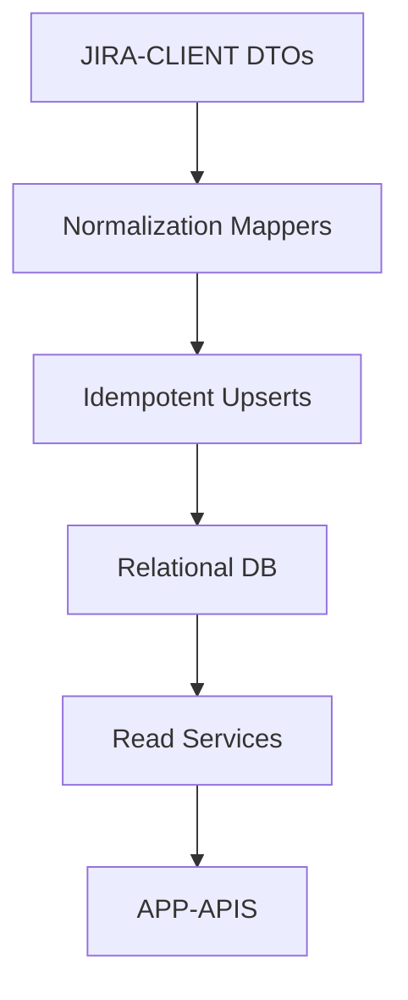

# TRD - Phase 1

## 1. Component Overview
- **Purpose:** Persist and serve normalized entities (Release, Epic, Story, Bug, Task) populated from Jira via ingestion jobs for APP-APIS and UI.
- **Scope:** Define schemas, mappers, ingestion pipeline (read from JIRA-CLIENT, write to DB), idempotent upserts, and basic audit logging.
- **Phase 1 Scope:** Minimal relational schema, ingestion jobs with pagination/backoff, normalization rules, and read services for APP-APIS.
- **Dependencies:** JIRA-CLIENT (normalized DTOs), database runtime.
- **Dependents:** APP-APIS (reads data), REPORTING (reads aggregated data).

## 2. Functional Requirements
- **FR-DATA-001:** Define canonical schemas for Release, Epic, Story, Bug, Task.
- **FR-DATA-002:** Implement ingestion jobs that upsert entities idempotently.
- **FR-DATA-003:** Normalize Jira payloads (statuses, memberships, links, priorities).
- **FR-DATA-004:** Provide read services for APP-APIS endpoints.
- **FR-DATA-005:** Log ingestion runs with counts and error summaries.

## 3. Component Interface

### 3.1 Ingestion API (internal)
- `ingestReleases(projectId)` → upsert Releases
- `ingestEpics(releaseId)` → upsert Epics
- `ingestStories(epicId|releaseId)` → upsert Stories
- `ingestSignals(releaseId)` → upsert Bugs/Tasks linked to Stories

### 3.2 Read Services (for APP-APIS)
- `listReleases(filters, pagination)` → paginated `Release`
- `getReleaseHierarchy(releaseId)` → `Epic` with nested `Story`
- `getReleaseSignals(releaseId)` → KPIs + grouped Bugs/Tasks; provide minimal aggregation functions (counts by status/priority, delayed items)

### 3.3 Contracts
- **Inputs:** Normalized DTOs from JIRA-CLIENT; identifiers and filters
- **Outputs:** Entities and aggregates; stable shapes used by APP-APIS

## 4. Data Model

### 4.1 Data Storage
- **Storage Type:** Relational DB (Postgres/MySQL acceptable); Phase 1 assumptions
- **Data Schema:**
```sql
CREATE TABLE releases (
  id TEXT PRIMARY KEY,
  name TEXT NOT NULL,
  status TEXT NOT NULL,
  project_id TEXT NOT NULL,
  updated_at TIMESTAMP NOT NULL DEFAULT NOW()
);

CREATE TABLE epics (
  id TEXT PRIMARY KEY,
  name TEXT NOT NULL,
  status_category TEXT NOT NULL,
  release_id TEXT REFERENCES releases(id),
  partial BOOLEAN DEFAULT FALSE,
  updated_at TIMESTAMP NOT NULL DEFAULT NOW()
);

CREATE TABLE stories (
  id TEXT PRIMARY KEY,
  epic_id TEXT REFERENCES epics(id),
  name TEXT NOT NULL,
  status_category TEXT NOT NULL,
  assignee TEXT,
  due_date DATE,
  delay_days INTEGER,
  multi_linked BOOLEAN DEFAULT FALSE,
  unlinked BOOLEAN DEFAULT FALSE,
  updated_at TIMESTAMP NOT NULL DEFAULT NOW()
);

CREATE TABLE bugs (
  id TEXT PRIMARY KEY,
  story_id TEXT REFERENCES stories(id),
  priority TEXT NOT NULL,
  status_category TEXT NOT NULL,
  updated_at TIMESTAMP NOT NULL DEFAULT NOW()
);

CREATE TABLE tasks (
  id TEXT PRIMARY KEY,
  story_id TEXT REFERENCES stories(id),
  status_category TEXT NOT NULL,
  updated_at TIMESTAMP NOT NULL DEFAULT NOW()
);

CREATE INDEX idx_epics_release ON epics(release_id);
CREATE INDEX idx_stories_epic ON stories(epic_id);
CREATE INDEX idx_bugs_story ON bugs(story_id);
CREATE INDEX idx_tasks_story ON tasks(story_id);

-- Optional aggregation views (Phase 1 convenience)
-- KPIs per release: counts and status breakdowns
-- Implement as service-level aggregates if DB views are deferred
```

### 4.2 Data Flow


### 4.3 Data Validation
- **Input Validation:** Ensure required fields; map unknowns to safe defaults; sanitize text
- **Business Rules:** Status to category mapping; release membership via fixVersions/labels
- **Data Integrity:** Foreign key constraints; updated_at tracking; unique IDs

## 5. Technology Stack

### 5.1 Core Technologies
- **Programming Language:** TypeScript/Nest data services
- **ORM/DB:** Prisma/TypeORM/Knex (choose one); Postgres recommended
- **Jobs:** Node/Nest cron or task runner

### 5.2 Technology Rationale
- **Why These Choices:** Rapid schema iteration and typed queries; Nest integration
- **Alternatives Considered:** Raw SQL; slower iteration, fewer safety nets
- **Trade-offs:** ORM abstraction cost; acceptable for MVP

## 6. Integration Design

### 6.1 Dependency Integration
- **JIRA-CLIENT:** Consume normalized DTOs; batch commit per page
- **APP-APIS:** Expose read aggregation functions to controllers

### 6.2 Service Integration
- **External Services:** None
- **Authentication:** N/A (internal DB)
- **Rate Limiting:** N/A (DB)
- **Fallback Strategies:** Retry transaction on transient DB errors

## 7. Performance Considerations

### 7.1 Requirements
- **Response Time:** Read queries ≤ 3s typical for releases with ≤ 50 epics
- **Throughput:** Ingestion completes within 10 minutes typical
- **Scalability:** Indexes and pagination

### 7.2 Strategies
- **Caching:** Defer; consider query caching later
- **Database Optimization:** Appropriate indexes; denormalized aggregates optional
- **Resource Management:** Batch upserts; transaction boundaries per page

## 8. Security Design

### 8.1 Requirements
- **Authentication:** DB credentials secured via env/secret manager
- **Authorization:** App-level controls (internal)
- **Data Protection:** No sensitive data persisted beyond required fields

### 8.2 Implementation
- **Encryption:** TLS to DB where applicable
- **Sanitization:** Input sanitization on text; avoid SQL injection
- **Audit Logging:** Ingestion run logs and counts

## 9. Monitoring & Observability

### 9.1 Logging
- **Log Levels:** Info for batches, Error on failures
- **Log Format:** Structured logs with run IDs
- **Sensitive Data:** Avoid logging PII

### 9.2 Metrics
- **Performance Metrics:** Rows ingested, latency, failures
- **Business Metrics:** Release/epic/story counts per run
- **Alerting:** Optional thresholds on failure/latency

## 10. Testing Strategy

### 10.1 Unit Testing
- **Coverage:** Mappers and upsert logic
- **Key Test Cases:** Idempotency, foreign key constraints, status mapping
- **Mock Dependencies:** Mock DTOs from JIRA-CLIENT

### 10.2 Integration Testing
- **Points:** DB migrations, ingestion end-to-end
- **Test Data:** Synthetic sample sets with edge cases
- **Environment:** Test DB with migrations

## 11. Deployment Considerations

### 11.1 Requirements
- **Infrastructure:** Managed Postgres and Nest job runner
- **Configuration:** DB URL, credentials, page sizes
- **Secrets:** Stored securely in env/secret manager

### 11.2 Strategy
- **Build:** Apply migrations; deploy data services
- **Deploy:** Rolling updates; job scheduling
- **Rollback:** Migration rollback strategy

## 12. Risk Mitigation
- **Risk R1 (Data Hygiene):** `needsReview` flags and empty-state guidance
- **Risk R2 (Large Payloads):** Pagination and batch transactions
- **Risk R3 (Schema Evolution):** Migrations and versioned DTOs

## 13. Future Considerations
- **Extensibility:** Aggregation tables for KPIs; materialized views
- **Migration Path:** Introduce soft deletes and changelog tables
- **Deprecation Strategy:** Versioned schemas and data services
