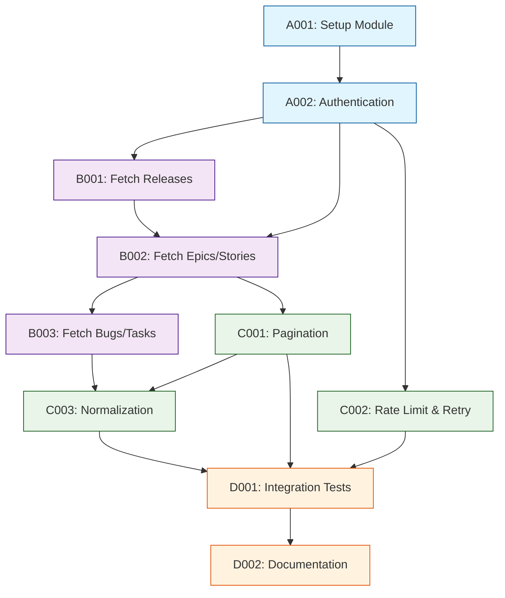

# Tasks - Phase 1

## 1. Task Overview

- **Component:** JIRA-CLIENT
- **Phase:** 1
- **Technical Spec:** [phase-1-technical-spec.md](./phase-1-technical-spec.md)
- **Total Estimated Effort:** 21 story points
- **Implementation Order:** 4 task groups in sequence
- **Phase 1 Scope:** Secure Jira API authentication, core entity fetching (Releases, Epics, Stories, Bugs, Tasks), pagination with rate-limit handling, and normalized DTO output for DATA-LAYER ingestion

## 2. Task Categories

### Category A: Foundation & Setup
Core authentication and HTTP client infrastructure

### Category B: Core Implementation
Entity fetching and JQL query construction

### Category C: Integration & Resilience
Pagination, rate-limiting, retries, and normalization

### Category D: Testing & Documentation
Comprehensive testing and integration documentation

## 3. Detailed Task Breakdown

### 📋 Foundation & Setup

#### TASK-A001: Setup Jira client module and dependencies

- **Summary:** JIRA-CLIENT - Setup Module Structure & Dependencies
- **Issue Type:** Story
- **Epic Link:** JIRA-CLIENT Epic
- **Story Points:** 2
- **Priority:** High
- **Labels:** setup, foundation, jira-client
- **Components:** JIRA-CLIENT

- **Description:**
    
    Create NestJS module structure for Jira API client with core dependencies and configuration setup.
    
- **Technical Requirements:**
    
    - Create `libs/jira-client` folder structure in Nx workspace
    - Install dependencies: `@nestjs/axios`, `axios`, `dotenv`
    - Setup module exports and barrel files
    - Configure TypeScript paths in `tsconfig.base.json`
    
- **Acceptance Criteria:**
    
    - Module structure created with proper Nx library setup
    - Dependencies installed and verified in `package.json`
    - Module can be imported by other apps in workspace
    - Basic module registration works in test context
    
- **Dependencies:** None

- **Jira Sub-tasks:**
    
    - Generate Nx library: `nx g @nx/node:library jira-client`
    - Install HTTP client dependencies
    - Create barrel exports in `index.ts`
    - Update workspace TypeScript paths

#### TASK-A002: Implement Jira authentication and configuration

- **Summary:** JIRA-CLIENT - Authentication & Config Management
- **Issue Type:** Story
- **Epic Link:** JIRA-CLIENT Epic
- **Story Points:** 3
- **Priority:** High
- **Labels:** authentication, security, jira-client
- **Components:** JIRA-CLIENT

- **Description:**
    
    Build secure authentication mechanism for Jira Cloud API using API tokens with Basic Auth, configuration management for Jira base URL, and credential storage.
    
- **Technical Requirements:**
    
    - Implement `JiraConfigService` with validation
    - Support API token authentication (email + token via Basic Auth)
    - Securely load credentials from environment variables
    - Add request interceptor for auth headers
    - Validate Jira base URL format
    
- **Acceptance Criteria:**
    
    - Environment variables: `JIRA_BASE_URL`, `JIRA_EMAIL`, `JIRA_API_TOKEN`
    - Config validation throws error on missing/invalid credentials
    - Auth headers automatically added to all requests
    - No credentials logged or exposed in error messages
    - Test connection endpoint verifies authentication
    
- **Dependencies:** TASK-A001

- **Jira Sub-tasks:**
    
    - Create `JiraConfigService` with env validation
    - Implement Basic Auth interceptor
    - Add credential validation logic
    - Create `testConnection()` method
    - Write unit tests for auth interceptor

### 🔧 Core Implementation

#### TASK-B001: Implement releases and versions fetching

- **Summary:** JIRA-CLIENT - Fetch Releases (Versions) from Jira
- **Issue Type:** Story
- **Epic Link:** JIRA-CLIENT Epic
- **Story Points:** 3
- **Priority:** High
- **Labels:** api, releases, jira-client
- **Components:** JIRA-CLIENT

- **Description:**
    
    Build API methods to fetch Jira versions (releases) for projects and map them to normalized Release DTOs with project association.
    
- **Technical Requirements:**
    
    - Implement `getVersions(projectKey: string)` method
    - Call Jira API: `GET /rest/api/3/project/{projectKey}/versions`
    - Map Jira versions to internal `ReleaseDTO` format
    - Extract `id`, `name`, `released`, `releaseDate` fields
    - Handle projects with no versions (empty array)
    
- **Acceptance Criteria:**
    
    - `getVersions()` returns array of `ReleaseDTO` objects
    - DTO includes: `id`, `name`, `status`, `projectId`
    - Empty array returned for projects without versions
    - Error handling for invalid project keys
    - Unit tests verify DTO mapping correctness
    
- **Dependencies:** TASK-A002

- **Jira Sub-tasks:**
    
    - Create `ReleaseDTO` interface
    - Implement `getVersions()` API call
    - Build DTO mapper function
    - Handle empty/null responses
    - Write unit tests with mocked responses

#### TASK-B002: Implement Epic and Story fetching with JQL

- **Summary:** JIRA-CLIENT - Fetch Epics and Stories via JQL Search
- **Issue Type:** Story
- **Epic Link:** JIRA-CLIENT Epic
- **Story Points:** 5
- **Priority:** High
- **Labels:** api, epics, stories, jql, jira-client
- **Components:** JIRA-CLIENT

- **Description:**
    
    Build JQL search functionality to fetch Epics and Stories for a target release, resolve Epic-Story relationships via Epic Link field, and normalize to internal DTOs.
    
- **Technical Requirements:**
    
    - Implement `searchIssues(jql: string, options)` method
    - Call Jira API: `POST /rest/api/3/search`
    - Build JQL queries for: Epics by fixVersion, Stories by fixVersion
    - Resolve Epic Link custom field (default: `customfield_10014`)
    - Map to `EpicDTO` and `StoryDTO` with relationships
    - Extract: `key`, `summary`, `status`, `statusCategory`, `assignee`, `duedate`
    - Handle spanning Epics (partial flag), orphaned Stories (unlinked flag)
    
- **Acceptance Criteria:**
    
    - `searchIssues()` executes JQL and returns normalized DTOs
    - Epic Link field ID configurable via environment variable
    - DTOs include: `id`, `name`, `statusCategory`, `epicId` (for stories)
    - Edge cases handled: missing Epic Link, multiple fixVersions
    - Status mapped to category: `To Do`, `In Progress`, `Done`
    - Unit tests verify DTO mapping and edge cases
    
- **Dependencies:** TASK-A002

- **Jira Sub-tasks:**
    
    - Create `EpicDTO` and `StoryDTO` interfaces
    - Implement `searchIssues()` with JQL support
    - Build JQL query helpers for releases
    - Implement Epic Link field resolution
    - Map status to statusCategory
    - Handle spanning/orphaned edge cases
    - Write comprehensive unit tests

#### TASK-B003: Implement Bug and Task fetching with issue links

- **Summary:** JIRA-CLIENT - Fetch Bugs and Tasks Linked to Stories
- **Issue Type:** Story
- **Epic Link:** JIRA-CLIENT Epic
- **Story Points:** 3
- **Priority:** Medium
- **Labels:** api, bugs, tasks, jira-client
- **Components:** JIRA-CLIENT

- **Description:**
    
    Fetch Bugs and Tasks linked to Stories via issue links or subtasks, normalize priority and status fields, and provide grouped DTOs by Story ID.
    
- **Technical Requirements:**
    
    - Extend `searchIssues()` to fetch Bugs (issuetype = Bug) and Tasks (issuetype = Task)
    - Use JQL to find issues linked to target Stories
    - Extract `priority` field for Bugs (P0-P4 mapping)
    - Map status to `statusCategory` for both Bugs and Tasks
    - Build `BugDTO` and `TaskDTO` with `storyId` association
    
- **Acceptance Criteria:**
    
    - `searchIssues()` can filter by issuetype (Bug, Task)
    - DTOs include: `id`, `storyId`, `priority` (Bugs only), `statusCategory`
    - Priority mapped to standard levels: P0, P1, P2, P3, P4, Unclassified
    - Status mapped to category: Open, In Progress, Closed
    - Unit tests verify DTO mapping and priority normalization
    
- **Dependencies:** TASK-B002

- **Jira Sub-tasks:**
    
    - Create `BugDTO` and `TaskDTO` interfaces
    - Implement JQL for linked issues
    - Build priority mapping logic (Highest→P0, High→P1, etc.)
    - Map task/bug status to categories
    - Write unit tests for priority/status mapping

### 🔗 Integration & Resilience

#### TASK-C001: Implement pagination and cursor management

- **Summary:** JIRA-CLIENT - Pagination Support for API Calls
- **Issue Type:** Story
- **Epic Link:** JIRA-CLIENT Epic
- **Story Points:** 3
- **Priority:** High
- **Labels:** pagination, performance, jira-client
- **Components:** JIRA-CLIENT

- **Description:**
    
    Add pagination support to handle large result sets from Jira API using `startAt` and `maxResults` parameters with cursor-based iteration.
    
- **Technical Requirements:**
    
    - Implement pagination options: `{ startAt, maxResults, maxPages }`
    - Default `maxResults` = 50, max = 100
    - Iterate through pages using `startAt` cursor
    - Return aggregated results or yield pages via generator
    - Track `total` results and calculate `isLastPage`
    
- **Acceptance Criteria:**
    
    - `searchIssues()` accepts pagination options
    - Automatically fetches all pages up to `maxPages` limit
    - Returns consolidated array of all fetched items
    - Pagination metadata included: `page`, `total`, `nextStartAt`
    - Unit tests verify multi-page fetching logic
    
- **Dependencies:** TASK-B002

- **Jira Sub-tasks:**
    
    - Add pagination options to `searchIssues()` signature
    - Implement page iteration logic with `startAt` cursor
    - Build result aggregation function
    - Add pagination metadata to responses
    - Write tests for multi-page scenarios

#### TASK-C002: Implement rate-limit handling and retry logic

- **Summary:** JIRA-CLIENT - Rate Limit Detection & Exponential Backoff
- **Issue Type:** Story
- **Epic Link:** JIRA-CLIENT Epic
- **Story Points:** 5
- **Priority:** High
- **Labels:** resilience, rate-limiting, error-handling, jira-client
- **Components:** JIRA-CLIENT

- **Description:**
    
    Detect Jira API rate limits (HTTP 429), implement exponential backoff with jitter, and add retry logic for transient failures with configurable max retries.
    
- **Technical Requirements:**
    
    - Detect HTTP 429 (rate limited) and 503 (service unavailable) responses
    - Implement exponential backoff: 1s, 2s, 4s, 8s with random jitter
    - Respect `Retry-After` header from Jira responses
    - Max retries: 3 (configurable via env)
    - Log retry attempts with correlation ID
    - Fail fast on non-retryable errors (401, 403, 404)
    
- **Acceptance Criteria:**
    
    - HTTP interceptor detects rate-limit responses (429, 503)
    - Exponential backoff implemented with jitter randomization
    - `Retry-After` header respected when present
    - Non-retryable errors fail immediately without retries
    - Retry attempts logged with request correlation ID
    - Unit tests verify backoff timing and retry limits
    
- **Dependencies:** TASK-A002

- **Jira Sub-tasks:**
    
    - Create HTTP response interceptor for error detection
    - Implement exponential backoff calculator with jitter
    - Add `Retry-After` header parsing
    - Configure max retries via environment variable
    - Add structured logging for retry attempts
    - Write unit tests for retry logic and backoff timing

#### TASK-C003: Build DTO normalization and data validation

- **Summary:** JIRA-CLIENT - DTO Normalization & Validation Layer
- **Issue Type:** Story
- **Epic Link:** JIRA-CLIENT Epic
- **Story Points:** 3
- **Priority:** Medium
- **Labels:** data-quality, normalization, jira-client
- **Components:** JIRA-CLIENT

- **Description:**
    
    Create normalization layer to transform raw Jira responses into consistent DTOs with validation, default value handling, and edge-case flagging.
    
- **Technical Requirements:**
    
    - Build normalization functions for each DTO type
    - Map Jira `status.statusCategory.name` → `statusCategory`
    - Calculate `delayDays` from `duedate` vs current date
    - Mark `needsReview` flag for missing/invalid data
    - Handle null/undefined fields with safe defaults
    - Validate required fields: `id`, `name`, `status`
    
- **Acceptance Criteria:**
    
    - All DTOs pass through normalization layer before returning
    - Status consistently mapped to: `To Do`, `In Progress`, `Done`
    - Delay calculation correct for past-due items with `statusCategory != Done`
    - `needsReview` flag set for items with missing critical data
    - Null/undefined fields replaced with safe defaults (empty string, 0, etc.)
    - Unit tests verify all normalization rules and edge cases
    
- **Dependencies:** TASK-B002, TASK-B003

- **Jira Sub-tasks:**
    
    - Create normalization utility functions
    - Implement status-to-category mapper
    - Build delay calculation logic
    - Add validation and `needsReview` flagging
    - Handle null/undefined field defaults
    - Write comprehensive unit tests

### ✨ Testing & Documentation

#### TASK-D001: Integration testing with test Jira project

- **Summary:** JIRA-CLIENT - Integration Tests with Real Jira API
- **Issue Type:** Story
- **Epic Link:** JIRA-CLIENT Epic
- **Story Points:** 5
- **Priority:** Medium
- **Labels:** testing, integration, jira-client
- **Components:** JIRA-CLIENT

- **Description:**
    
    Create integration test suite that calls actual Jira Cloud API using test credentials and validates end-to-end data fetching and normalization.
    
- **Technical Requirements:**
    
    - Setup test Jira Cloud project with synthetic data
    - Create sample Epics, Stories, Bugs, Tasks with known relationships
    - Test all fetch methods: versions, epics, stories, bugs, tasks
    - Verify pagination by creating 100+ test issues
    - Test rate-limit handling (if possible within limits)
    - Validate DTO structure and data accuracy
    
- **Acceptance Criteria:**
    
    - Integration tests run against test Jira project
    - Test credentials loaded from separate `.env.test` file
    - All fetch methods successfully return expected DTOs
    - Pagination tested with multi-page results
    - DTO normalization verified with real Jira response shapes
    - Tests pass in CI/CD with mocked responses (real tests optional in CI)
    
- **Dependencies:** TASK-C001, TASK-C002, TASK-C003

- **Jira Sub-tasks:**
    
    - Setup test Jira Cloud project and credentials
    - Create synthetic test data in Jira
    - Write integration tests for each fetch method
    - Test pagination with 100+ issues
    - Add CI/CD configuration with mocked responses
    - Document test data setup process

#### TASK-D002: API documentation and usage examples

- **Summary:** JIRA-CLIENT - Documentation & Developer Guide
- **Issue Type:** Story
- **Epic Link:** JIRA-CLIENT Epic
- **Story Points:** 2
- **Priority:** Low
- **Labels:** documentation, jira-client
- **Components:** JIRA-CLIENT

- **Description:**
    
    Write comprehensive API documentation, usage examples, configuration guide, and troubleshooting tips for JIRA-CLIENT module.
    
- **Technical Requirements:**
    
    - Document all public methods with JSDoc comments
    - Create `README.md` with setup instructions
    - Provide code examples for common use cases
    - Document environment variable configuration
    - Add troubleshooting section for common errors
    - Include DTO interface documentation
    
- **Acceptance Criteria:**
    
    - All public methods have JSDoc comments with parameter types
    - `README.md` includes: setup, configuration, usage examples, troubleshooting
    - Code examples cover: authentication, fetching releases, epics, stories
    - Environment variables documented with required/optional indicators
    - Troubleshooting guide covers: auth failures, rate limits, JQL errors
    - API reference generated from JSDoc comments
    
- **Dependencies:** TASK-D001

- **Jira Sub-tasks:**
    
    - Add JSDoc comments to all public methods
    - Write `README.md` with setup guide
    - Create usage example code snippets
    - Document environment variables
    - Write troubleshooting guide
    - Generate API reference documentation

## 4. Task Dependencies & Sequencing

## 5. Parallel Development Opportunities

### What Can Be Built Simultaneously:

- **After A002:** B001 and C002 can start in parallel
- **After B002:** B003 and C001 can start in parallel
- **After C001, C002, C003:** All prerequisites for D001 integration tests

### Critical Path:

A001 → A002 → B002 → C003 → D001 → D002

## 6. Risk Mitigation Tasks

### Technical Risks:

- **Risk JIRA-R1 (Rate Limits):** Mitigated in TASK-C002 with backoff and retry
- **Risk JIRA-R2 (Custom Fields):** Epic Link field ID configurable via env in TASK-B002
- **Risk JIRA-R3 (Data Quality):** `needsReview` flags in TASK-C003 normalization

## 7. Definition of Done

### Task Completion Criteria:

- ✅ All acceptance criteria met
- ✅ Unit tests written and passing (>80% coverage)
- ✅ Code review completed
- ✅ Integration tests passing (where applicable)
- ✅ JSDoc documentation added

### Component Completion Criteria:

- ✅ All tasks completed per definition of done
- ✅ Technical specification requirements met
- ✅ Integration with DATA-LAYER verified
- ✅ Authentication and rate-limiting robust
- ✅ Ready for ingestion pipeline integration

## 8. Estimation Summary

| Category | Task Count | Total Effort | Duration (days) |
|----------|-----------|--------------|-----------------|
| Foundation & Setup | 2 | 5 points | 2-3 days |
| Core Implementation | 3 | 11 points | 5-6 days |
| Integration & Resilience | 3 | 11 points | 5-6 days |
| Testing & Documentation | 2 | 7 points | 3-4 days |
| **TOTAL** | **10** | **34 points** | **15-19 days** |

## 9. Traceability Matrix

| Task ID | Technical Spec Section | Functional Requirements | Business Value |
|---------|------------------------|-------------------------|----------------|
| A001 | Section 5.1 | Setup/Infrastructure | Development efficiency |
| A002 | Section 8.1 | FR-JIRA-CLIENT-001 | Secure API access |
| B001 | Section 3.1 | FR-JIRA-CLIENT-002 | Release data fetching |
| B002 | Section 3.1, 4.1 | FR-JIRA-CLIENT-003 | Epic-Story hierarchy |
| B003 | Section 3.1 | FR-JIRA-CLIENT-004 | Quality signals data |
| C001 | Section 3.2 | FR-JIRA-CLIENT-005 | Large dataset handling |
| C002 | Section 6.2 | FR-JIRA-CLIENT-005 | API resilience |
| C003 | Section 4.1, 4.3 | FR-JIRA-CLIENT-006 | Data quality |
| D001 | Section 10.2 | Testing Strategy | Quality assurance |
| D002 | Section 11.1 | Documentation | Developer experience |

## 10. Implementation Notes

### Development Best Practices:

- Use strongly-typed DTOs with TypeScript interfaces
- Implement request/response interceptors for cross-cutting concerns
- Use structured logging with correlation IDs for debugging
- Keep Jira-specific logic isolated from business logic

### Quality Gates:

- Unit test coverage minimum 80%
- Integration tests pass with test Jira project
- No credentials logged or exposed in errors
- Rate-limit handling tested with retry scenarios

### Communication Plan:

- Daily standup updates on API integration progress
- Demo working Jira connectivity after TASK-A002
- Escalate Jira Cloud API issues to Atlassian support if needed
- Document any custom field discoveries for team reference
