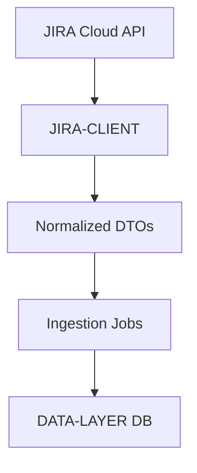

# TRD - Phase 1

## 1. Component Overview
- **Purpose:** Securely consume Jira Cloud APIs to fetch Epics, Stories, Bugs, Tasks, and Releases, normalizing payloads for ingestion into the DATA-LAYER.
- **Scope:** Implement authenticated client, pagination and rate-limit handling, core endpoints, normalized output contracts, and scheduler integration hooks.
- **Phase 1 Scope:** Read-only API consumption with retries/backoff, idempotent batch fetches, and response normalization; write to DATA-LAYER via ingestion jobs (separate module).
- **Dependencies:** Jira Cloud API v3, secure credentials (API token/OAuth), network connectivity.
- **Dependents:** DATA-LAYER (ingestion pipeline), APP-APIS (serves persisted data), REPORTING (later).

## 2. Functional Requirements
- **FR-JIRA-CLIENT-001:** Authenticate with Jira (API token or OAuth) and store secrets securely.
- **FR-JIRA-CLIENT-002:** Fetch releases via versions metadata and map fixVersion/labels.
- **FR-JIRA-CLIENT-003:** Fetch Epics and linked Stories for a target release (via JQL/search).
- **FR-JIRA-CLIENT-004:** Fetch Bugs by priority and Tasks by status linked to Stories.
- **FR-JIRA-CLIENT-005:** Support pagination (`startAt`, `maxResults`) and rate-limit backoff.
- **FR-JIRA-CLIENT-006:** Provide normalized response contracts to DATA-LAYER ingestion.
- **FR-JIRA-CLIENT-007:** Expose scheduler hooks for periodic data pulls (ingestion triggers).

## 3. Component Interface

### 3.1 Client API
- `getVersions(projectId)` → Versions (releases)
- `searchIssues(jql, options)` → Paginated Issues
- `getIssue(issueIdOrKey)` → Issue detail
- `getIssueChangelog(issueIdOrKey)` → Status history (for delay heuristics)
- `getPriorities()` → Bug priority taxonomy

### 3.2 Input/Output Contracts
- **Inputs:** Jira base URL, credentials, project/release identifiers, JQL filters
- **Outputs:** Normalized entities: `Release`, `Epic`, `Story`, `Bug`, `Task` with minimal field sets (`key`, `summary`, `statusCategory`, `issuetype`, `fixVersions`, `labels`, `assignee`, `duedate`, `priority`, links)
- **Data Formats:** JSON; strongly-typed mappers to internal DTOs

### 3.3 Error Handling
- **Error Types:** Auth failure, rate limited, network error, API error, invalid JQL
- **Error Responses:** Standardized error object `{ code, message, details }`; retries with exponential backoff on transient errors
- **Recovery Strategies:** Partial batch completion with audit logs; continue pagination; skip corrupt items with `needsReview`

## 4. Data Model

### 4.1 Normalization Mappers
- Map Jira `status` → `statusCategory` (To Do/In Progress/Done)
- Derive `release membership` from `fixVersions` or `labels`
- Resolve `Epic ↔ Story` via Epic Link custom field and issue links
- Derive `delayDays` from `duedate` vs current date and `statusCategory`

### 4.2 Data Flow

### 4.3 Data Validation
- **Input Validation:** Validate project/release IDs; JQL sanitization
- **Business Rules:** Ensure consistent DTO shapes; mark unknowns with `needsReview`
- **Data Integrity:** Idempotent runs using `updated` timestamp and changelog

## 5. Technology Stack

### 5.1 Core Technologies
- **Programming Language:** TypeScript
- **Framework:** Node/Nest-friendly client package (usable by ingestion)
- **HTTP:** `fetch`/`axios` with interceptors for auth and backoff

### 5.2 Technology Rationale
- **Why These Choices:** Interoperable with NestJS app and Node jobs; mature HTTP tooling
- **Alternatives Considered:** Direct Atlassian SDKs; heavier integration than needed
- **Trade-offs:** Custom client logic needed for backoff and normalization

## 6. Integration Design

### 6.1 Dependency Integration
- **DATA-LAYER:** Emit normalized DTOs to ingestion pipeline
- **Communication Method:** In-memory handoff or message queue (Phase 1: direct call)
- **Data Exchange:** Typed DTO arrays with pagination cursors

### 6.2 Service Integration
- **External APIs:** Jira Cloud REST API v3
- **Authentication:** API token via Basic Auth or OAuth; secrets via env/secret store
- **Rate Limiting:** Detect 429; exponential backoff with jitter; max 3 retries
- **Fallback Strategies:** Reduce `maxResults`; pause/resume batches

## 7. Performance Considerations

### 7.1 Requirements
- **Response Time:** Single page fetch ≤ 2s typical
- **Throughput:** Batch ingestion within 10 minutes for typical releases
- **Scalability:** Paginated fetch with configurable page size

### 7.2 Strategies
- **Batching:** Page through `maxResults` with cursors; parallel-safe but single-threaded per project
- **Filtering:** Use JQL to constrain payloads to target release
- **Resource Management:** Avoid excessive concurrency; respect quotas

## 8. Security Design

### 8.1 Requirements
- **Authentication:** API token/OAuth mandatory
- **Authorization:** Scoped to project(s) needed
- **Data Protection:** Do not persist credentials; redact sensitive fields

### 8.2 Implementation
- **Encryption:** TLS; secure env vars; avoid logging credentials
- **Input Sanitization:** JQL construction avoids injection
- **Audit Logging:** Log run ID, start/end times, counts, failures

## 9. Monitoring & Observability

### 9.1 Logging
- **Log Levels:** Info for batch steps; Warn/Error for retries/failures
- **Log Format:** Structured logs with correlation IDs/run IDs
- **Sensitive Data:** Redact tokens and PII

### 9.2 Metrics
- **Performance Metrics:** Pages fetched, items per second, retry counts
- **Business Metrics:** Releases/Epics/Stories/Bugs/Tasks counts per run
- **Alerting:** Optional threshold alerts on failure rates

## 10. Testing Strategy

### 10.1 Unit Testing
- **Coverage:** Auth interceptor, backoff logic, mappers
- **Key Test Cases:** Pagination, rate-limit handling, DTO normalization
- **Mock Dependencies:** Mock HTTP responses for Jira endpoints

### 10.2 Integration Testing
- **Points:** End-to-end sample fetches against a test Jira project
- **Test Data:** Synthetic issues with known fields and relationships
- **Environment:** Secrets injected via env; limited rate-limit tests

## 11. Deployment Considerations

### 11.1 Requirements
- **Infrastructure:** Node runtime for jobs/client
- **Configuration:** Jira base URL, credentials, project IDs, page size
- **Secrets:** Store in env/secret manager; rotate regularly

### 11.2 Strategy
- **Build:** Package client library; include type defs
- **Deploy:** Ship with ingestion service; versioned releases
- **Rollback:** Previous client version

## 12. Risk Mitigation
- **Risk R1 (Rate Limits):** Backoff + pagination; chunked batches
- **Risk R2 (Custom Fields):** Configurable Epic Link field ID mapping
- **Risk R3 (Data Quality):** `needsReview` flags; empty-state guidance

## 13. Future Considerations
- **Extensibility:** Support Agile API for sprints; webhooks for change events
- **Migration Path:** Move to OAuth with refresh; per-project concurrency tuning
- **Deprecation Strategy:** Version DTOs and client methods
