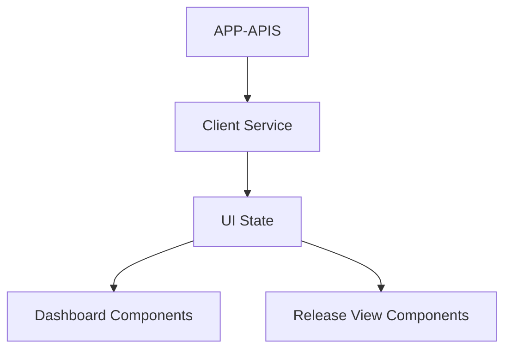

# TRD - Phase 1

## 1. Component Overview
- **Purpose:** Render the hierarchical release view, KPIs, bugs/tasks, and delay indicators by binding UI components to APP-APIS endpoints.
- **Scope:** Implement data fetching, state management, and UI binding for Dashboard and Release views using the generated components.
- **Phase 1 Scope:** Read-only binding to backend; progressive loading; empty/error states; minimal filters; no auth.
- **Dependencies:** APP-APIS (contracts), DATA-LAYER (populated data), UI-CODEGEN (components/pages).
- **Dependents:** REPORTING (optionally reads UI state for exports).

## 2. Functional Requirements
- **FR-UI-001:** Release selector populated via `/api/releases` with pagination.
- **FR-UI-002:** Hierarchical view binds to `/api/release/:id/hierarchy` with edge-case indicators.
- **FR-UI-003:** KPIs and signals bind to `/api/release/:id/signals` (bugs/tasks grouped).
- **FR-UI-004:** Display delay indicators with days overdue and indicative timeline shift.
- **FR-UI-005:** Handle empty states and standardized errors gracefully.
- **FR-UI-006:** Render summary graphs for status breakdowns (bar/donut) using data from backend.

## 3. Component Interface

### 3.1 Pages & Components
- Pages: `Dashboard`, `ReleaseView`
- Components: `MetricsOverview`, `HierarchyView`, `ReleaseProgress`, `BugTaskSummary`, `DelayAnalysis`, `DetailGrids`, charts

### 3.2 Input/Output Contracts
- **Inputs:** Backend responses per APP-APIS contracts; user interactions (select release). Compatibility layer maps existing mock endpoints to real routes.
- **Outputs:** Rendered UI; loading skeletons; error banners; tooltips for indicators
- **Data Formats:** JSON via fetch; typed client layer based on `New Project Setup/src/services/api.ts`

#### Endpoint Mapping (Client Service)
- `/api/releases/:id/metrics` → calls `/api/release/:id/signals` and maps to KPIs
- `/api/releases/:id/epics` → calls `/api/release/:id/hierarchy` and maps to epics/stories
- `/api/releases/:id/charts` → optional; derive chart data locally from signals/hierarchy for Phase 1

### 3.3 Error Handling
- **Error Types:** Network/API errors; not-found; empty datasets
- **Error Responses:** UI banners/messages; retry options; empty-guidance tooltips
- **Recovery Strategies:** Progressive loading; partial renders; fallback graphs with zero values

## 4. Data Model

### 4.1 UI State
- **Storage Type:** Component-level state + lightweight client service
- **Data Schema:** Release list, selected release, hierarchy tree, signals/KPIs, chart datasets

### 4.2 Data Flow

### 4.3 Data Validation
- **Input Validation:** Validate response shapes; default missing fields to safe values
- **Business Rules:** Show indicators for partial/multi-linked/unlinked stories
- **Integrity:** Keep UI consistent across refresh via deterministic rendering

## 5. Technology Stack

### 5.1 Core Technologies
- **Programming Language:** TypeScript/React
- **Framework:** Vite + React (`apps/ui-hk-gamar`)
- **Client Layer:** `New Project Setup/src/services/api.ts` adapted to real endpoints

### 5.2 Technology Rationale
- **Why These Choices:** Matches current setup and generated components
- **Alternatives Considered:** Global state (Redux) deferred for MVP
- **Trade-offs:** Local state may duplicate fetches; acceptable for MVP

## 6. Integration Design

### 6.1 Dependency Integration
- **APP-APIS:** Bind to documented endpoints; map to component props
- **Communication Method:** Browser fetch with error handling and loaders
- **Data Exchange:** JSON responses mapped to UI models

### 6.2 Service Integration
- **External Services:** None
- **Authentication:** Deferred
- **Rate Limiting:** N/A client-side (handle server 429 with user messaging)
- **Fallback Strategies:** Skeletons; degraded views; tooltips for unknowns

## 7. Performance Considerations

### 7.1 Requirements
- **Response Time:** Initial render ≤ 3s; progressive sections thereafter
- **Throughput:** N/A
- **Scalability:** Progressive loading; pagination for lists (releases)

### 7.2 Strategies
- **Progressive UI:** Load KPIs first, then hierarchy
- **Chunked Rendering:** Virtualize large lists (optional)
- **Asset Optimization:** Use CSS variables; reduce reflows
 - **Timeouts/Retry:** Apply short timeouts (e.g., 5s) and a single retry for KPI fetch before rendering fallback

## 8. Security Design

### 8.1 Requirements
- **Authentication:** Deferred
- **Authorization:** Deferred
- **Data Protection:** No sensitive data shown beyond essentials

### 8.2 Implementation
- **Sanitization:** Render-only; avoid HTML injection
- **Audit Logging:** N/A client-side

## 9. Monitoring & Observability

### 9.1 Logging
- **Client Logs:** Minimal console logs in dev
- **Sensitive Data:** None logged

### 9.2 Metrics
- **Performance Metrics:** Optional web vitals; latency marks
- **Alerting:** N/A

## 10. Testing Strategy

### 10.1 Unit Testing
- **Coverage:** Components render with mock data; indicator visibility
- **Key Test Cases:** Empty/error states; KPI and chart rendering
- **Mock Dependencies:** Mock client service responses

### 10.2 Integration Testing
- **Points:** End-to-end fetch + render using dev backend
- **Test Data:** Sample releases/epics/stories/bugs/tasks
- **Environment:** Vite dev server + Nest backend

## 11. Deployment Considerations

### 11.1 Requirements
- **Infrastructure:** Static hosting of Vite build
- **Configuration:** API base URL `/api`; env override
- **Secrets:** None

### 11.2 Strategy
- **Build:** Vite/Nx build; map base paths
- **Deploy:** Serve static files; backend proxy `/api`
- **Rollback:** Redeploy previous build

## 12. Risk Mitigation
- **Risk R1 (Contract Drift):** Align models to APP-APIS TRD; adapt client
- **Risk R2 (Large Hierarchies):** Progressive load; virtualization (optional)
- **Risk R3 (Data Quality):** Show `needsReview` indicators for unknowns
 - **Risk R4 (Endpoint Differences):** Use compatibility mapping layer to avoid breaking changes in UI

## 13. Future Considerations
- **Extensibility:** Global state management; caching
- **Migration Path:** SSR/SSG if needed; route-level code-splitting
- **Deprecation Strategy:** Version UI models and components
