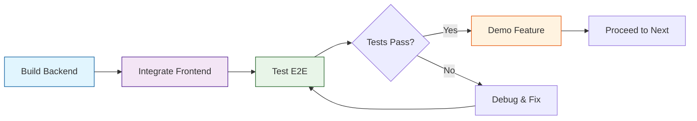

# MVP Execution Flow: Build → Integrate → Test → Proceed

## 🎯 Overview

This document defines the **incremental development flow** for building the MVP. Each feature follows the pattern: **Backend → Frontend Integration → Testing → Validation** before moving to the next feature.

**Core Principle:** Ship working features incrementally, not all at once.

---

## 🔄 Execution Pattern (Per Feature)



---

## 📦 Feature 1: Project & Release Selection

### Goal
User can select a project and see its releases in dropdown selectors.

---

### **Step 1.1: Backend - Projects List API**

**Duration:** 1-2 days

**Tasks:**
- [ ] **DATA-LAYER**: Add distinct project query in read service
- [ ] **APP-APIS**: Implement `GET /api/projects` endpoint
- [ ] Endpoint returns: `[{ id: 'PROJ-1', name: 'Project Name' }]`

**Test Backend:**
```bash
# Start backend
cd apps/bff-hk-gamar
npm run start:dev

# Test endpoint
curl http://localhost:3000/api/projects
# Expected: [{"id":"PROJ-1","name":"Project Name"}]
```

**Validation:**
- ✅ Endpoint returns 200 with array of projects
- ✅ Projects have valid `id` and `name` fields
- ✅ Empty array returned if no data (not error)

---

### **Step 1.2: Backend - Releases List API**

**Duration:** 1-2 days

**Tasks:**
- [ ] **DATA-LAYER**: Implement `listReleases(filters, pagination)` service
- [ ] **APP-APIS**: Implement `GET /api/releases?projectId=XXX` endpoint
- [ ] Handle pagination: `{ version, items: [...], pageInfo: {...} }`

**Test Backend:**
```bash
# Test endpoint
curl "http://localhost:3000/api/releases?projectId=PROJ-1"
# Expected: {"version":"v1","items":[...],"pageInfo":{...}}
```

**Validation:**
- ✅ Endpoint returns releases for valid project
- ✅ Empty items array for project with no releases
- ✅ Pagination metadata included
- ✅ 400 error for missing projectId

---

### **Step 1.3: Frontend Integration**

**Duration:** 0.5-1 day

**Tasks:**
- [ ] Update `src/services/api.ts`:

```typescript
// Replace fetchProjects mock
export const fetchProjects = async (): Promise<Project[]> => {
  const response = await fetch(`${API_BASE_URL}/projects`);
  if (!response.ok) throw new Error(`HTTP ${response.status}`);
  return await response.json();
};

// Replace fetchReleases mock
export const fetchReleases = async (projectId: string): Promise<Release[]> => {
  const response = await fetch(
    `${API_BASE_URL}/releases?projectId=${encodeURIComponent(projectId)}`
  );
  if (!response.ok) throw new Error(`HTTP ${response.status}`);
  const data = await response.json();
  return data.items || [];
};
```

- [ ] Add `.env.development`:
```bash
VITE_API_BASE_URL=http://localhost:3000/api
```

- [ ] Update `api.ts`:
```typescript
const API_BASE_URL = import.meta.env.VITE_API_BASE_URL || '/api';
```

**Test Frontend:**
```bash
# Start frontend
cd "New Project Setup"
npm run dev

# Open browser: http://localhost:5173
# Check: Project dropdown should load real projects
# Check: Selecting project loads real releases
```

**Validation:**
- ✅ Project dropdown populates from backend
- ✅ Release dropdown loads when project selected
- ✅ No CORS errors in console
- ✅ Network tab shows successful API calls

---

### **Step 1.4: End-to-End Testing**

**Duration:** 0.5 day

**Test Scenarios:**

1. **Happy Path:**
    - [ ] Open dashboard → projects load
    - [ ] Select project → releases load
    - [ ] Switch project → releases update

2. **Error Scenarios:**
    - [ ] Backend offline → error message displays
    - [ ] Invalid project ID → empty releases
    - [ ] Network timeout → retry button works

3. **Edge Cases:**
    - [ ] Project with no releases → empty state
    - [ ] Very long project names → UI doesn't break
    - [ ] Rapid project switching → no race conditions

**Validation Checklist:**
- ✅ All scenarios pass
- ✅ No console errors
- ✅ Loading states work correctly
- ✅ Error handling is user-friendly

---

### **Step 1.5: Demo & Proceed**

**Demo Checkpoint:**
- Show working project/release selection to team
- Get feedback on UX
- Document any issues found

**If tests pass:** ✅ **Proceed to Feature 2**

---

## 📦 Feature 2: Dashboard Metrics (KPIs)

### Goal
Display 6 KPI metrics cards on dashboard for selected release.

---

### **Step 2.1: Backend - Data Layer Signals Service**

**Duration:** 2-3 days

**Tasks:**
- [ ] **DATA-LAYER TASK-C003**: Implement `getReleaseSignals(releaseId)` service
- [ ] Calculate KPIs:
    - Overall completion %
    - Epics completed (count)
    - Stories on track (count)
    - Delayed items (count)
    - Open bugs (count)
    - Open tasks (count)
- [ ] Group bugs by priority
- [ ] Group tasks by status

**Test Backend:**
```bash
# Test signals endpoint
curl http://localhost:3000/api/release/rel-1/signals
# Expected: {"version":"v1","kpis":{...},"bugs":{...},"tasks":{...}}
```

**Validation:**
- ✅ All KPI calculations correct
- ✅ Bug grouping by priority works
- ✅ Task grouping by status works
- ✅ 404 for invalid release ID

---

### **Step 2.2: Backend - Signals API Endpoint**

**Duration:** 1-2 days

**Tasks:**
- [ ] **APP-APIS TASK-B003**: Implement `GET /api/release/:id/signals` endpoint
- [ ] **APP-APIS TASK-C001**: Add alias `GET /api/releases/:id/metrics`
- [ ] Map DATA-LAYER response to frontend format

**Test Backend:**
```bash
# Test both endpoints
curl http://localhost:3000/api/release/rel-1/signals
curl http://localhost:3000/api/releases/rel-1/metrics
# Both should return KPIs in frontend-compatible format
```

**Validation:**
- ✅ Signals endpoint returns KPIs
- ✅ Alias endpoint works identically
- ✅ Response format matches frontend `MetricData[]` interface
- ✅ Calculations match database state

---

### **Step 2.3: Frontend Integration**

**Duration:** 0.5-1 day

**Tasks:**
- [ ] Update `src/services/api.ts`:

```typescript
// Replace fetchMetrics mock
export const fetchMetrics = async (releaseId: string): Promise<MetricData[]> => {
  const response = await fetch(
    `${API_BASE_URL}/releases/${releaseId}/metrics`
  );
  if (!response.ok) throw new Error(`HTTP ${response.status}`);
  const data = await response.json();
  
  // Transform backend KPIs to frontend MetricData format
  return [
    {
      label: 'Overall Completion',
      value: data.kpis.overallCompletion || '0%',
      change: data.kpis.completionChange || '+0%',
      trend: data.kpis.overallCompletion > '50%' ? 'up' : 'neutral',
      icon: 'Target',
      color: 'text-[--color-chart-1]',
      bgColor: 'bg-[--color-chart-1] bg-opacity-10',
      cardBg: 'bg-gradient-to-br from-green-50 to-emerald-50'
    },
    {
      label: 'Epics Completed',
      value: data.kpis.epicsCompleted || '0/0',
      change: data.kpis.epicsPercentage || '0%',
      trend: 'neutral',
      icon: 'Layers',
      color: 'text-[--color-chart-2]',
      bgColor: 'bg-[--color-chart-2] bg-opacity-10',
      cardBg: 'bg-gradient-to-br from-orange-50 to-amber-50'
    },
    {
      label: 'Stories On Track',
      value: data.kpis.storiesOnTrack || '0/0',
      change: data.kpis.storiesPercentage || '0%',
      trend: 'neutral',
      icon: 'BookCheck',
      color: 'text-[--color-chart-1]',
      bgColor: 'bg-[--color-chart-1] bg-opacity-10',
      cardBg: 'bg-gradient-to-br from-blue-50 to-cyan-50'
    },
    {
      label: 'Delayed Items',
      value: String(data.kpis.delayedItems || 0),
      change: data.kpis.delayedChange || '+0',
      trend: data.kpis.delayedItems > 0 ? 'down' : 'up',
      icon: 'Clock',
      color: 'text-primary',
      bgColor: 'bg-primary bg-opacity-10',
      cardBg: 'bg-gradient-to-br from-red-50 to-rose-50'
    },
    {
      label: 'Open Bugs',
      value: String(data.kpis.openBugs || 0),
      change: data.kpis.bugsChange || '0',
      trend: data.kpis.openBugs < 10 ? 'up' : 'down',
      icon: 'ShieldAlert',
      color: 'text-primary',
      bgColor: 'bg-primary bg-opacity-10',
      cardBg: 'bg-gradient-to-br from-pink-50 to-fuchsia-50'
    },
    {
      label: 'Open Tasks',
      value: String(data.kpis.openTasks || 0),
      change: data.kpis.tasksChange || '0',
      trend: data.kpis.openTasks < 50 ? 'up' : 'down',
      icon: 'ListTodo',
      color: 'text-[--color-chart-3]',
      bgColor: 'bg-[--color-chart-3] bg-opacity-10',
      cardBg: 'bg-gradient-to-br from-purple-50 to-violet-50'
    }
  ];
};
```

**Test Frontend:**
```bash
# Verify metrics display
# 1. Select release
# 2. Check 6 metric cards render
# 3. Verify values match backend data
```

**Validation:**
- ✅ Metrics cards display with real data
- ✅ Values update when release changes
- ✅ Trend indicators (up/down/neutral) correct
- ✅ No layout issues with varying value lengths

---

### **Step 2.4: End-to-End Testing**

**Test Scenarios:**

1. **Data Accuracy:**
    - [ ] Completion % matches database calculations
    - [ ] Bug/task counts accurate
    - [ ] Delayed items count correct

2. **Dynamic Updates:**
    - [ ] Switching releases updates metrics
    - [ ] Loading state shows during fetch
    - [ ] Error state for invalid release

3. **Visual Validation:**
    - [ ] All 6 cards display correctly
    - [ ] Icons render properly
    - [ ] Color coding appropriate for values

**Validation:**
- ✅ All calculations verified against database
- ✅ UI updates smoothly
- ✅ No data inconsistencies

---

### **Step 2.5: Demo & Proceed**

**Demo Checkpoint:**
- Show working metrics dashboard
- Validate calculations with actual Jira data
- Get stakeholder feedback

**If tests pass:** ✅ **Proceed to Feature 3**

---

## 📦 Feature 3: Epic-Story Hierarchy View

### Goal
Display nested Epic → Stories hierarchy with status indicators.

---

### **Step 3.1: Backend - Hierarchy Service**

**Duration:** 2-3 days

**Tasks:**
- [ ] **DATA-LAYER TASK-C002**: Implement `getReleaseHierarchy(releaseId)` service
- [ ] Fetch Epics with nested Stories (single query, no N+1)
- [ ] Include edge-case flags: `partial`, `multiLinked`, `unlinked`
- [ ] Calculate epic progress from story completion
- [ ] Handle orphaned stories

**Test Backend:**
```bash
curl http://localhost:3000/api/release/rel-1/hierarchy
# Expected: {"version":"v1","release":{...},"epics":[...],"orphanedStories":[...]}
```

**Validation:**
- ✅ Epics include nested stories
- ✅ Epic progress calculated correctly
- ✅ Orphaned stories in separate array
- ✅ Edge-case flags set appropriately
- ✅ Query optimized (no N+1 problem)

---

### **Step 3.2: Backend - Hierarchy API Endpoint**

**Duration:** 1-2 days

**Tasks:**
- [ ] **APP-APIS TASK-B002**: Implement `GET /api/release/:id/hierarchy` endpoint
- [ ] **APP-APIS TASK-C001**: Add alias `GET /api/releases/:id/epics`
- [ ] Map status categories to frontend enum: `completed`, `inProgress`, `delayed`, `notStarted`
- [ ] Calculate story delay status

**Test Backend:**
```bash
curl http://localhost:3000/api/releases/rel-1/epics
# Verify status mapping and progress calculations
```

**Validation:**
- ✅ Status mapped correctly
- ✅ Delayed stories flagged (delayDays > 0)
- ✅ Bug/task counts included per story
- ✅ Both endpoints work identically

---

### **Step 3.3: Frontend Integration**

**Duration:** 0.5-1 day

**Tasks:**
- [ ] Update `src/services/api.ts`:

```typescript
// Replace fetchEpics mock
export const fetchEpics = async (releaseId: string): Promise<Epic[]> => {
  const response = await fetch(
    `${API_BASE_URL}/releases/${releaseId}/epics`
  );
  if (!response.ok) throw new Error(`HTTP ${response.status}`);
  const data = await response.json();
  return data.epics || [];
};
```

**Test Frontend:**
```bash
# Verify hierarchy view
# 1. Select release
# 2. Check HierarchyView component displays epics
# 3. Verify nested stories show under each epic
# 4. Check delayed items highlighted
```

**Validation:**
- ✅ Hierarchy renders with real data
- ✅ Epic progress bars accurate
- ✅ Story status colors correct
- ✅ Delayed items highlighted
- ✅ Bug/task counts display

---

### **Step 3.4: End-to-End Testing**

**Test Scenarios:**

1. **Hierarchy Structure:**
    - [ ] Epics display in correct order
    - [ ] Stories nested under correct epic
    - [ ] Orphaned stories shown separately

2. **Status Indicators:**
    - [ ] Completed items green
    - [ ] In-progress items blue
    - [ ] Delayed items red/orange
    - [ ] Not started items gray

3. **Edge Cases:**
    - [ ] Epic with no stories displays correctly
    - [ ] Story with 0 bugs/tasks shows properly
    - [ ] Very long epic/story names don't break layout

**Validation:**
- ✅ Hierarchy matches database structure
- ✅ All status indicators accurate
- ✅ Layout handles edge cases

---

### **Step 3.5: Demo & Proceed**

**Demo Checkpoint:**
- Show working hierarchy visualization
- Demonstrate drill-down from epic to stories
- Validate delayed item detection

**If tests pass:** ✅ **Proceed to Feature 4**

---

## 📦 Feature 4: Charts & Visualizations

### Goal
Display completion trends, status distribution, and bug/task charts.

---

### **Step 4.1: Backend - Chart Data Derivation**

**Duration:** 1-2 days

**Tasks:**
- [ ] **APP-APIS**: Implement `GET /api/releases/:id/charts` endpoint
- [ ] Derive chart data from existing signals and hierarchy
- [ ] Or implement stub with basic time-series data

**Note:** For MVP, charts can be simplified or stubbed initially.

**Test Backend:**
```bash
curl http://localhost:3000/api/releases/rel-1/charts
```

---

### **Step 4.2: Frontend Integration**

**Duration:** 0.5-1 day

**Tasks:**
- [ ] Replace `fetchChartData` mock in `api.ts`
- [ ] Verify chart components render with real data

---

### **Step 4.3: Testing & Demo**

**Validation:**
- ✅ Charts display data accurately
- ✅ Visual representations clear
- ✅ Responsive on different screen sizes

**If tests pass:** ✅ **MVP Feature Complete!**

---

## 🎯 Complete MVP Integration Checklist

### Backend Completion
- [ ] All JIRA-CLIENT tasks completed
- [ ] All DATA-LAYER tasks completed
- [ ] All APP-APIS tasks completed
- [ ] Database populated with ingestion pipeline
- [ ] All endpoints tested with Postman/curl

### Frontend Integration
- [ ] All 5 API functions replaced (no mocks remaining)
- [ ] `.env` files configured
- [ ] CORS working (no errors)
- [ ] Loading states functional
- [ ] Error handling working

### End-to-End Testing
- [ ] Project/release selection works
- [ ] Metrics display accurately
- [ ] Hierarchy shows correct structure
- [ ] Charts render properly
- [ ] All edge cases handled
- [ ] Performance acceptable (<3s load)

### Production Readiness
- [ ] Error logging implemented
- [ ] Request timeouts added
- [ ] Environment variables documented
- [ ] Deployment guide created
- [ ] User documentation written

---

## 📊 Progress Tracking

Use this table to track completion:

| Feature | Backend | Frontend | Testing | Demo | Status |
|---------|---------|----------|---------|------|--------|
| 1. Project/Release Selection | ⬜ | ⬜ | ⬜ | ⬜ | Not Started |
| 2. Dashboard Metrics | ⬜ | ⬜ | ⬜ | ⬜ | Not Started |
| 3. Hierarchy View | ⬜ | ⬜ | ⬜ | ⬜ | Not Started |
| 4. Charts/Visualizations | ⬜ | ⬜ | ⬜ | ⬜ | Not Started |

**Legend:** ⬜ Not Started | 🟡 In Progress | ✅ Complete

---

## 🚀 Quick Start: Begin Feature 1

```bash
# Terminal 1: Backend Development
cd apps/bff-hk-gamar
npm run start:dev

# Terminal 2: Frontend Development  
cd "New Project Setup"
npm run dev

# Terminal 3: Testing/Verification
# Run curl commands and test in browser
```

**Start with Feature 1, Step 1.1** and follow the flow sequentially. Each feature builds on the previous, ensuring stable incremental progress toward your MVP! 🎉

---

## 💡 Tips for Success

1. **Don't skip testing steps** - catch issues early
2. **Demo after each feature** - get feedback immediately
3. **Document issues as you go** - don't forget edge cases
4. **Keep backend and frontend in sync** - coordinate API contracts
5. **Commit working code frequently** - maintain stable checkpoints

This incremental approach ensures you always have a **working, demo-able product** at each stage! 🚀
